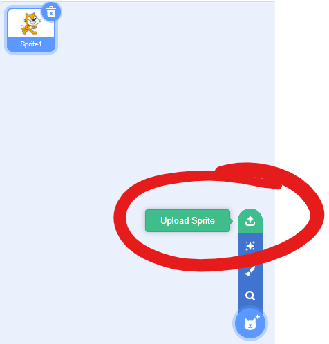
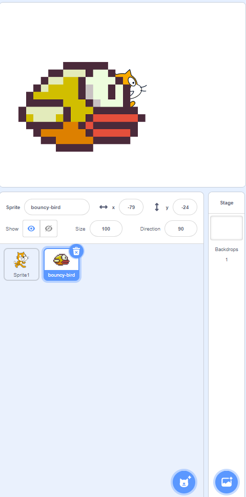
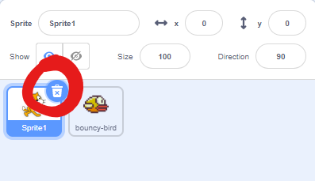
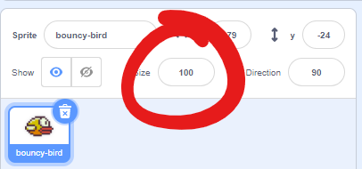
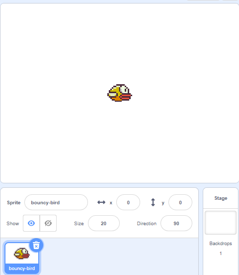

# Setting Up

[|< Home](../README.md)  
[<< Previous: Making a game](./bouncy-bird0.md)  
[>> Next: make the bird fly](./bouncy-bird2.md)

## First things first

Create a new project in Scratch

## Get a Sprite

The first thing to do is to change the picture used for the main sprite. You can use one of the standard pictures or one of your own. In this case, you'll use one of your own.

Right-click on the picture below and save the image to somewhere on your computer - remember where you save it.

Now go into scratch and in the sprite selection area, click the `Choose a sprite` button and choose `Upload Sprite`

Find where you saved the image and double-click it to select and upload it.

You'll get a new sprite (probably called bouncy-bird) on top of the default Sprite 1 cat.

## Clean up a bit

We are not going to use the default `Sprite 1`, so delete it. Highlight the `Sprite 1` tile and click the delete button.

Next, our bird is way too big. With the `bouncy-bird` sprite tile selected, change the size from 100 to 20.

While you're at it, change the x and y values to 0 so the bird sits in the middle of the output screen.

Now it's time to move on to making the bird fly

[|< Home](../README.md)  
[<< Previous: Making a game](./bouncy-bird0.md)  
[>> Next: Make the bird fly](./bouncy-bird2.md)
