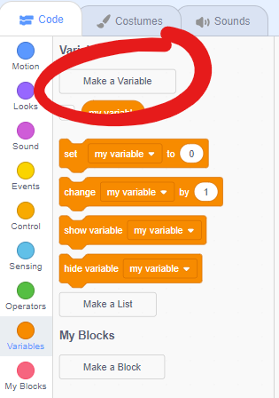
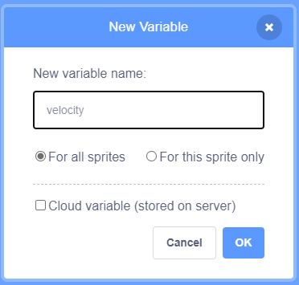
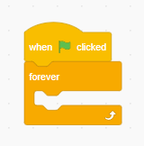
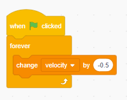
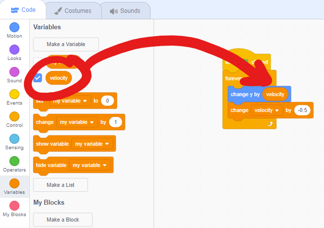
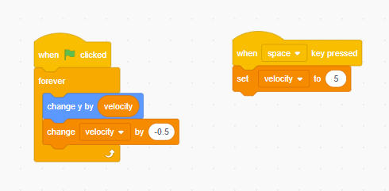

# Make the bird fly

[|< Home](../README.md)  
[<< Previous: Setting up](./bouncy-bird1.md)  
[>> Next: Detecting collisions](./bouncy-bird3.md)

Now we will make the bird move. The way the game works is that whenever the space bar is pressed, the bird goes up a bit, but it immediately starts falling again unless space is pressed again.

To make this work we need two different bits of code controlling the bird, one that happens all the time (making it fall) and one that happens when the space key is pressed (making it flap and rise).

How fast and in which direction the bird is moving is called its velocity, so we'll create a variable to store that value.

In the `Variables` group, click the `Make a Variable` button and call the variable `velocity`

> ## Aside
>
> Notice that, by default, the value of variables you create are displayed in the output window. This can sometimes be very useful when you're debugging, but you can turn the display off for your final game for most variables by unchecking the box next to the variable name in the `Variables` group. One exception might be the score.

## Make the bird fall

To make the bird accelerate as though it's falling, its velocity should decrease all the time. This calls for a `Forever loop` that starts as soon as the game starts.

As the game starts when the green flag is pressed, drag a `when green flag clicked` block from the `Events` group onto the code canvas. Next, drag a `forever loop` block from the `Control` group under that.

Now drag a `change my variable by 1` block from the `Variables` group into the `forever loop`. Drop-down the `my variable` and change it to `velocity`, and change the amount from `1` to `-0.5`

Run the program by clicking the green flag and notice that the velocity value very quickly gets very negative, but the bird doesn't move.

To make the bird move, we need to change its position.

Drag a `change y by 10` block from the `Motion` group to directly above the `change velocity` block inside the `forever loop`.

Drag a `velocity` block from the `Variables` group to replace the `10`.

Run the program by clicking on the green flag and watch the bird fall to the bottom of the screen.

## Make the bird flap

Now it's time to add the spacebar flapping mechanic.

To react to the spacebar, drag a `when space key pressed` block from the `Events` group onto a blank spot on the code canvas.

Drag a `set my variable to 0` block directly under the `when space key pressed` block.

Change the `my variable` to `velocity` and `0` to `5`. This will make the bird flap upwards at a velocity of 5 each time the space bar is pressed.

Run the game by clicking the green flag and use the space bar to control the position of the bird.

## Reset the position and velocity at the start

You might have noticed that restarting the game doesn't put the bird back in the middle of the screen, or reset the velocity to 0.

To do that:

* drag a `set my variable to 0` block from the `Variables` group to between the `when green flag clicked` and `forever loop` blocks and change `my variable` to `velocity`; and
* drag a `set y to -189` block from the `Motion` group to between the `when green flag clicked` and `set velocity to 0` blocks and change `-189` to `0`.

Now we are ready to move on to detecting when the bird collides with the edge of the screen.

[|< Home](../README.md)  
[<< Previous: Setting up](./bouncy-bird1.md)  
[>> Next: Detecting collisions](./bouncy-bird3.md)
