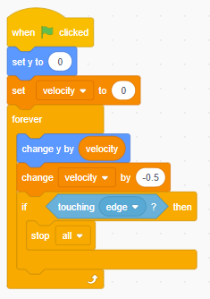

# Detecting Collisions

[|< Home](../README.md)  
[<< Previous: Making the bird fly](./bouncy-bird2.md)  
[>> Next: Adding pipes](./bouncy-bird4.md)

At the moment, the game doesn't end when the bird hits the bottom (or the top) of the screen.

At the end of the `forever loop` we will check if the game bird is touching the edge and stop the game if it is.

* Drag an `if then`  block from the `Control` group to underneath the `change velocity by -0.5` block.
* Drag a `touching mouse pointer ?` block from the `Sensing` group into the blank space in the `if then` block and change the sensed touch from `mouse pointer` to `edge`
* To stop the game, drag a `stop all` block from the `Control` group to inside the `if then` block.

Run the game and notice that when you touch the top or the bottom, the game stops.

Now we are ready to add the final touch, pipes.

[|< Home](../README.md)  
[<< Previous: Making the bird fly](./bouncy-bird2.md)  
[>> Next: Adding pipes](./bouncy-bird4.md)
