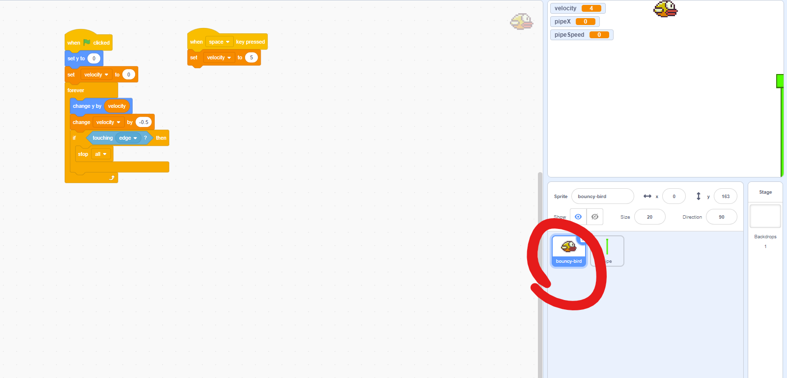
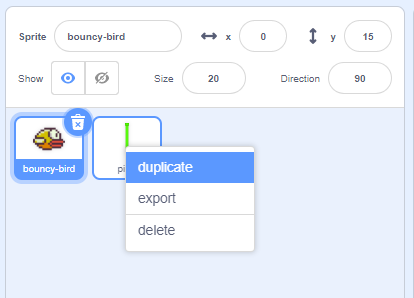

# Adding pipes

[|< Home](../README.md)  
[<< Previous: Detecting collisions](./bouncy-bird3.md)  
[>> Next: Ideas for enhancements](./bouncy-bird5.md)

We have the bird flying up and down, but there's nothing for it to run into, so we will add some pipes.

Like we did with the bird, we are going to use one of our own images for the pipes.

Right-click on the picture below and save it somewhere on your computer.

The image is purposefully long - you'll see why as we go along.

Add another sprite by uploading the pipe image in the same way you uploaded the bird.

Change the sprite's x value to 252 and y value to -150, this will start it on the right-hand side of the screen with the top somewhere near the middle.

.

Now it's time to get our pipe moving. To do that we'll control the pipe location and speed with variables (so we can use them on the upper pipe as well).

Create 2 variables called `pipeX` and `pipeSpeed` by clicking on the `Make a Variable` button in the `Variables` group.

Now the pipe needs to be moved every frame while ever the game is running - in a `forever loop`.

* Drag a `when green flag clicked` block from the `Events` group onto the code canvas.
* Add a `forever loop` from the `Control` group directly below it
* Drag a `set x to 252` block from the `Motion` group into the `forever loop`
* Replace the `252` with a `pipeX` variable block

Now we need to change the pipeX value over time. We do that in the bird `forever loop` to keep things in one neat place and avoid setting variables in multiple loops which can lead to unpredictable results if one loop happens slightly before another.

Click on the `bouncy-bird` sprite tile to bring the bouncy-bird code back.

There are now two things to do: change the `pipeX` variable (which will move the pipes) and check whether the bird is touching a pipe.

At the start of the game, we need to set a pipe speed.

* Drag a `set my variable to 0` block from the `Variables` group to between the `set velocity to 0` and the `forever loop`.
* Change `my variable` to `pipeSpeed`
* Change `0` to `5`

Every time we go through the loop we need to change the `pipeX` value

* Drag a `change my variable by 1` block from the `Variables` group to the top of the `forever loop`
* Change `my variable` to `pipeX`
* Replace the 1 with a  `*` block from the `Operators` group
* Enter `-1` in the left space in the `*` operator
* Drag a `pipeSpeed` variable block from the `Variables` group to the right space in the `*` operator

Run the game, the pipe should move across the screen, and then get stuck on the left-hand side.

We need to check if the pipe is on the left and if so, move it to the right.

* Drag an `if then` block from the `Control` group to an empty part of the code canvas
* Put a `< 50` block from the `Operators` group into the `if` clause of th the `if then` block
* put a `pipeX` variable block into the blank space in the `< 50` operator from the `Varibles` group
* Change the `50` to `-252`
* Drag a `set my variable to 0` block from the `Variables` group into the `if pipeX < -252 then` block
* change `my variable` to `pipeX` and `0` to `252`
* Finally, drag the entire `if pipeX < -252 then` block directly below the `change pipeX by -1 * pipeSpeed` block

Run the game, the pipe should move across the screen, and then pop back to the right-hand side.

## Adding another pipe

We need two pipes, one upper and one lower, so right-click on the pipe sprite tile and choose duplicate.

We want this pipe to be the other way up, so set its direction to `270` (or `-90`) and its y to `300`

This puts the pipe upside down and above the other pipe.

Run the game, both pipes should move across the screen, and then pop back to the right-hand side.

## Detect pipe collision

Now we just need to detect whether the bird runs into either pipe.

* Click back on the `bouncy-bird` sprite tile to select the control code
* Drag an `or` block from the `Operators` group onto a blank space on the code canvas
* Drag a `touching mouse-pointer ?` block from the `Sensing` group into one of the blank spaces on the `or` operator
* Change the `mouse-pointer` to `pipe`
* Drag another `touching mouse-pointer ?` block from the `Sensing` group into the other blank space on the `or` operator
* Change the `mouse-pointer` to `pipe2`

* Drag another `or` block onto a blank space on the canvas
* Drag the `touching edge ?` block out of the `if touching edge ? then` block into a blank space in the new `or` block
* Drag the `touching pipe ? or toughing pipe 2` block into the other blank space in the new `or` block

Finally, drag the entire new `or` block back into the empty `if then` block.

Your final code should look like this.

Run the game and you should be able to keep going indefinitely unless you run into the edge or a pipe.

## Enhancements

You can do lots of things to make the game more fun. See the next section for some ideas.

[|< Home](../README.md)  
[<< Previous: Detecting collisions](./bouncy-bird3.md)  
[>> Next: Ideas for enhancements](./bouncy-bird5.md)
