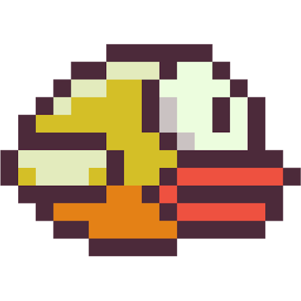

# Flappy Bird

## Bird

### Making the bird

First thing we are going to do is get the bird. If you right-click the image bellow and save it where you choose, you can then go back on scratch and click on the costume at the top left. if you hover over the choose icon button and go up to the upload and click. then in that pop-up you find the image you saved, select it and then click open.

You will see on the right that the bird is very big. change to size to 25.

### Gravity

First thing we are going to do is make a new sprite by clicking on the cat in the bottom right corner. You can then choose what ever one you want because it is going to be hiden. Then grab a when space is pressed from the events. Click on the drop down and change it to r. Then in the looks area put the hide block under the new event.

Now go to variables and click new variable and name it velocity. Under hide put a set velocity to 0 by changing the varible selected. Then put a set variable to 0 under the set velocity to 0. Then put a forever under that from the controle area. Now in variables put a change my variable by 1 inside of the for ever so that it is always being run. change the variable from my variable to velocity and change the 1 to -0.5 wso that the bird goes donw not up. what this is doing is it is decreasing the velocity of the bird meaning it will fall faster and faster.

If you press r you will see that nothing happened. This is because we had only stated velocity and have not used it. so click on the bird in the sprite area. put a when r is pressed like before and put a goto x and y block from the motion area, under that and make shore they are both 0. Then put change y by block in the forever. go back to the variables and drag the velocity variable in to the number space on the change y by.

### Edge collision

Now if you press r the bird should fall. Now if the bird hits the top of the bottom we want the game to end. we can do this by cheching if the bird is touching the edges and if so the put the game in game over state. To start we need to put an if then braket in the forever. We want if touching edge then. We can find the touching in the sensing area. Put it in the empty space next to the if and click on the drop down and select edge. Then create a nother variable called game state and select the new varible in a set varible in the if braket. Change the number to 1.

Now we can put the game in a state 1 (game over state), but it does nothing. Go back to the chosen variable sprite and put a nothher if braket in the forever to chech for game state 1 to see if the game is over. Select game state and go to the operators area and drag the blank = blank in to the space next the if. Now drag the game state variable into the first space and 1 in the other. the put an end all block from the control area and put it in the new if braket. Then put a set game state to 0 under the hide block.

### Flapping

In the variable sprite put a when space is pressed. Under that put a set velocity to 5. Now when you press r and then space the bird should do up.

### face where its going

We what the bird to face to direction it is moving. So make a new variable called direction facing then in the birds forever put a set direction facing with a * operator in the first space of a - operaator. In the first * space put velocity in, for the second space put -8. In the other - space put -90. Under that put a point in direction and put direction facing variable in.

