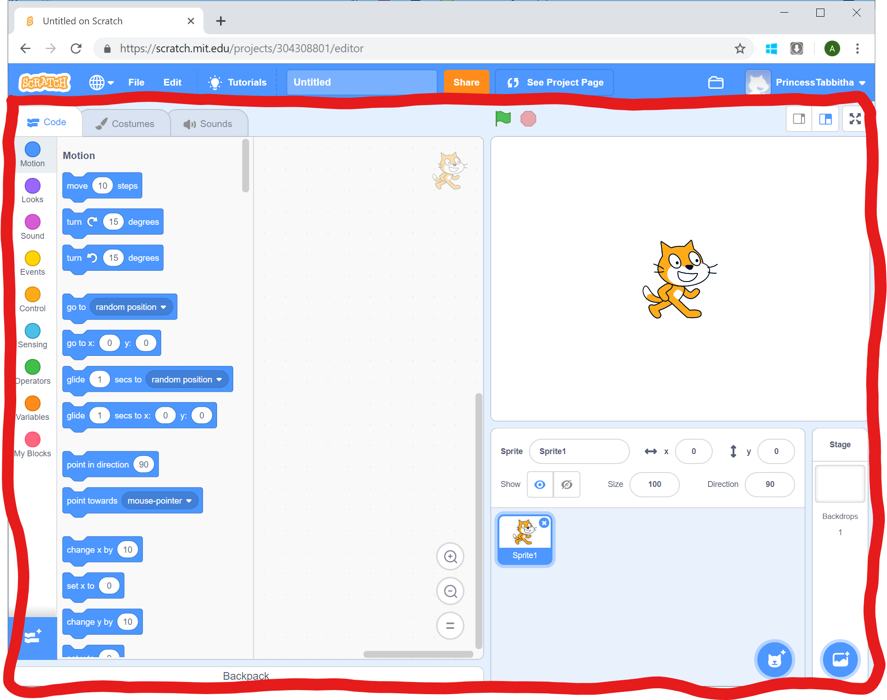
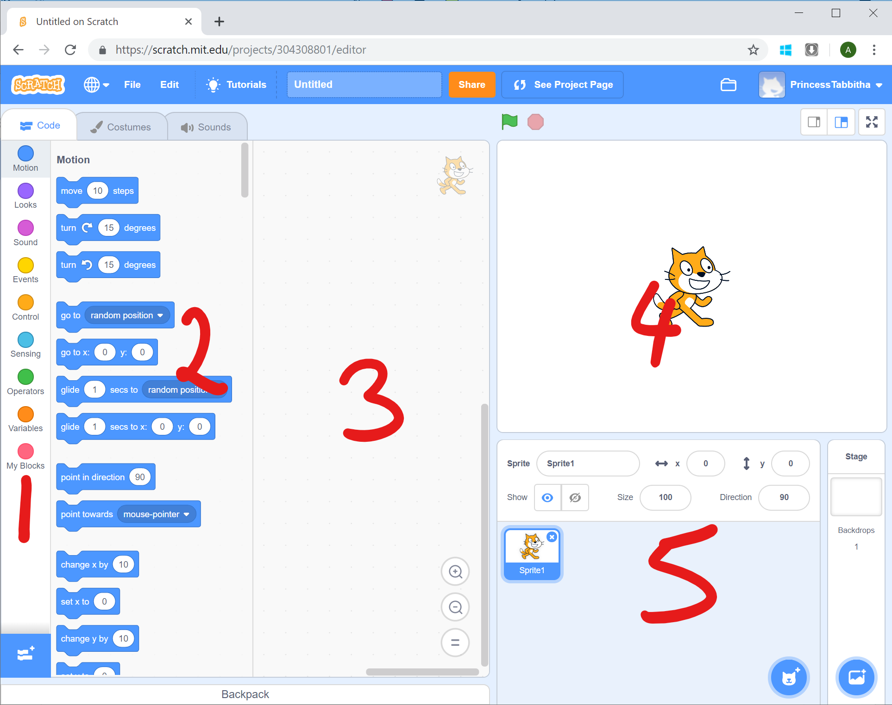

# Getting started with Scratch

[|< Home](../README.md)

## Introducing Scratch

[Scratch](https://scratch.mit.edu/about) is an Interactive Development Environment (IDE) designed at MIT.

Scratch is a block-based development language which means that programming consists of putting blocks together rather than typing code. This makes learning some programming concepts easier because instead of concentrating on learning syntax, programming consists of assembling functionality and clicking it together.

One of the key tenants the Scratch team adopted was the ability to share projects to encourage learning through examining others' work. By creating a Scratch account and signing into scratch, your own work is automatically saved, and you can explore the work of others and share your own projects.

## Your Scratch Account

### Creating an account (first time only)

> **Note**  
You can skip this step if you already have a Scratch Account

To create an account for Scratch, navigate to the [Scratch homepage](https://scratch.mit.edu) and click the Join Scratch link in the top navigation bar.

Enter the details on the next few screens

### Signing In

> **Note**  
If you've signed into Scratch on this computer before, you may not need to sign in again.

If you've already got a scratch account or the next time you come back to your computer, you may need to sign into scratch. To do this, click the Sign In link on the [Scratch homepage](https://scratch.mit.edu).

Enter your user name and the password you chose and click the Sign In button.

You should now see your user name at the top of the page.

## The Scratch Environment

To start programming in Scratch, click on the Create link in the navigation bar on the [Scratch homepage](https://scratch.mit.edu)

This will take you to the Scratch Development Environment.

This may look a bit complicated at first, but you'll get used to it very quickly and all the pieces will make sense.

### Scratch Window Panes

Inside the development environment there are a number of different areas or panes. We'll explore them in more detail in later tutorials, but it's worth giving them names so when we refer to them later everyone is talking about the same thing.

Across the top of the window is the Information and Navigation pane.

This area allows you to

- name your project and to share it
- load a project you've saved previously
- sign out, change your preferences and profile settings

Under the Information and Navigation pane is the coding area - this is where you'll spend most of your time.

The coding area is made up of five main panes:

1. Block Groups
1. Blocks
1. Code
1. Output
1. Sprite Selection

### Groups and Blocks

### Extensions

## Learning from Others

## More Scratch Resources

- [Scratch FAQs](https://scratch.mit.edu/info/faq)
- [Information for Parents](https://scratch.mit.edu/parents)

[|< Home](../README.md)