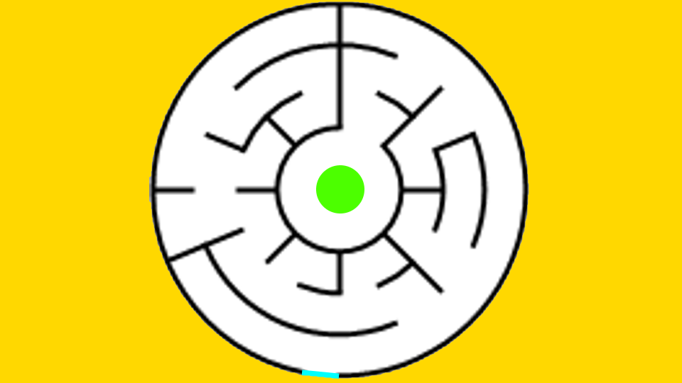

# Generated Mazes

Most of the mazes in this folder were generated using the online maze generator at [mazegenerator.net](http://mazegenerator.net/) and downloaded as .png files.

They were then processed using [paint.net](https://www.getpaint.net/) as follows:

1. If required, flip or rotate so the starting point is the middle of the bottom
1. Resize image to Height = 540px
1. Resize canvas to Width = 960px
1. Add start line (colour #00FFFF)
1. Add finish line (color #4CFF00)
1. Fill outside (colour #FFD800)

