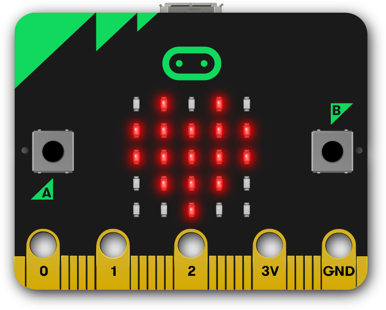

# Mazes - Controlling the Real World

[|< Home](../README.md)  
[>> Next: Standing on the shoulders of giants](./maze1.md)

In this tutorial you'll learn 2 important things.

1. How to build on the work of others; and
1. How to interact with your Scratch program using real-world objects, in this case a [BBC micro:bit](https://microbit.org/)

By the end of this tutorial you will have:

* Started a new project based on one someone else has published
* Modified the project to use new controls
* Added support for the BBC micro:bit using Scratch Extensions

## Contents

This tutorial consists of 6 sections:

1. [Standing on the shoulders of giants](./maze1.md)
2. [Adding you own controls](./maze2.md)
3. [Connecting your BBC micro:bit](./maze3.md)
4. [Controlling the game with tilt](./maze4.md)
5. [Adding a brake](./maze5.md)
6. [Ideas for more enhancements](./maze6.md)

[|< Home](../README.md)  
[>> Next: Standing on the shoulders of giants](./maze1.md)
