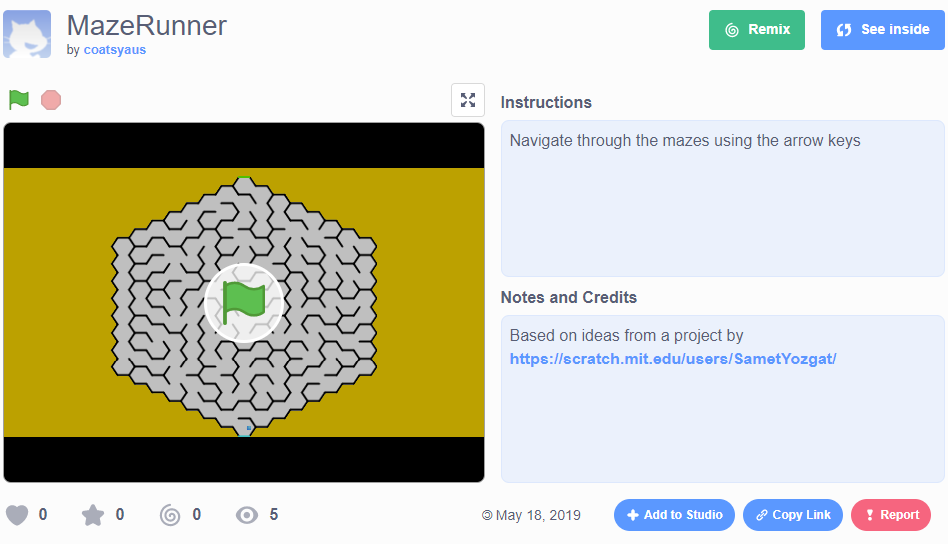

# Standing on the shoulders of giants+

[|< Home](../README.md)  
[<< Previous: Mazes - Controlling the real world](./maze0.md)  
[>> Next: Adding you own controls](./maze2.md)

One of the great things about scratch is that it's designed to encourage sharing of your projects and building on the work of others. In this tutorial you're going to take a simple maze game that someone else has written and enhance it with new controls.

Rather than starting from scratch (pardon the pun), you're going to use an existing project as a starting point. In Scratch this is called "remixing".

The project you'll be remixing is called MazeRunner. Open it by clicking on [this link](https://scratch.mit.edu/projects/305304451). You should see something like this

To play the game, click the green flag and then control the ball through the maze from the blue start line to the green finish line. You might find it easier if you click the full screen button to make the game bigger.

Each time you run into a wall you lose a point. Each time you get to the finish you get 10 points.

You can examine the code for the game by clicking the blue `See inside` button.

This is going to be your starting point.

Click the green `Remix` button and you'll get your own copy of the project called MazeRunner remix (you can change this if you want to).

Now you're ready to go onto the next section, adding your own controls.

[|< Home](../README.md)  
[<< Previous: Mazes - Controlling the real world](./maze0.md)  
[>> Next: Adding you own controls](./maze2.md)

> + This quote is attributed to Isaac Newton who, when talking about his achievements as a scientist, said:  
> *If I have seen a little further than others, it is from standing on the shoulders of giants*