# Adding your own controls

[|< Home](../README.md)  
[<< Previous: Standing on the shoulders of giants](./maze1.md)  
[>> Next: Connecting your BBC micro:bit](./maze3.md)

As a starting point, the MazeRunner game uses the keyboard arrow keys to move the ball. In this part of the tutorial you will examine the code used to do that and add your own code to also allow the use of the WSAD keys.

Examine the code that runs when the green flag is pressed - the blocks that live under the event block that looks like this:

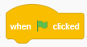

The first two blocks reset the maze to the first backdrop in the list of backdrops and ensures that the ball is the correct colour.

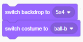

## My Blocks

The next block is one you may not have seen. It's an example of what scratch calls `My Blocks`, in this case one called `BallToStart`.

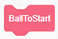

This block tells scratch to look for another set of blocks with that name and to run all of those blocks then come back and continue. In this case the code is very simple, it just moves the ball back to a starting position.

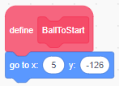

Other programming languages call this type of block `functions` or `methods` and they're useful for a couple of reasons.

Firstly, they allow you to get a bunch of code out of the way so things are easier to read. Secondly, and probably more importantly, they allow you to define functionality that is used more than once, so rather than having to copy code or repeat it somehow, you can just call the MyBlock from wherever that bit of work needs to be done. Have a look and see if you can find somewhere else in the code where the `BallToStart` block is used.

### Creating a My Block

The last bit of setup the game does is to reset the speed, score and level to their initial values. When you look at all of the setup blocks together they look like this:

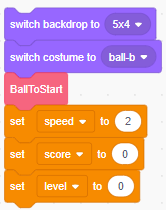

This is a prime candidate to break out into a `My Block`. To do that, click on My Blocks in the block groups area:

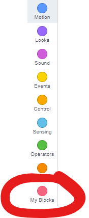

Now click the `Make a Block` button

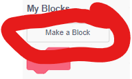

In the next screen, give your new block a name, like `SetupGame` and click the OK button.

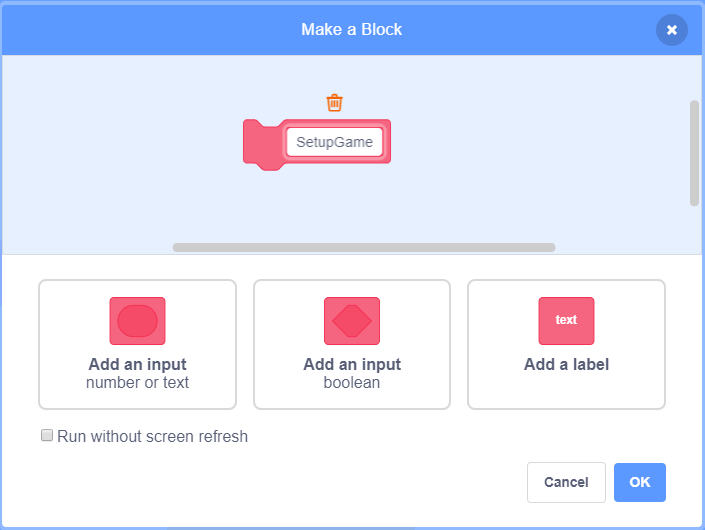

Once you click OK, a new block header will appear in your code area:

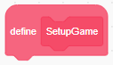

Extract the setup steps from the main code by dragging them off the Green Flag event block and onto your new header block. Note that the rest of the code will come along for now - that's ok, we'll fix that in a moment.

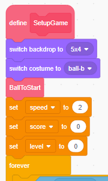

Next, find the `SetupGame` block (or whatever you called it) in the My Blocks area and drag it across to the Green Flag event block.

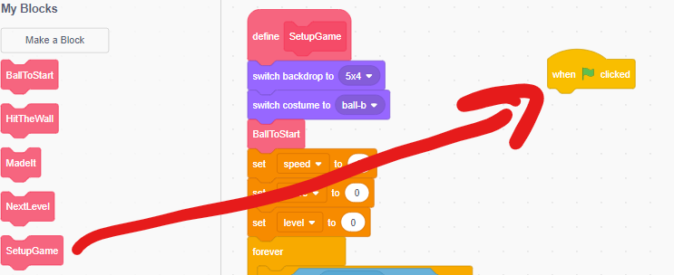

Now move the actual game code, that is everything inside the `forever` loop back under the `SetupGame` block.

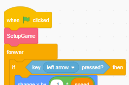

Finally, if you want to, you can move the `SetupGame` definition across to be with the other `My Block` definitions. This isn't required, but it's often considered good practice to keep all your `My Block` definitions together.

Run the game and test that everything still runs just as it did before.

>By the way, did you notice that the `SetupGame` definition includes a call to another My Block (in this case the `BallToStart` block? This is fine - anything that can go in a block of code, including a call to a My Block can go within a My Block definition.

## Adding Controls

The original author of the game used the arrow keys to control the ball in the maze. Your job now is to add the option to use the [WASD keys](https://en.m.wikipedia.org/wiki/Arrow_keys#WASD_keys) to move.

MazeRunner uses the concept of a game loop - that is a sequence of instructions the computer runs as often as it can, responding to the conditions it finds each time it passes through the loop.

> ### Aside
>
> An alternative to a game loop is to use an event-driven architecture where the computer waits for something to happen (like a key-press) and responds. This is how most turn-based games and most business software works as it reduces the load on the computer, allowing more complex things to happen with fewer resources.However, real-time games need to process changes to the screen as frequently as possible so often use a game loop. Loops like this are also often used when programming boards like Arduino and the BBC micro:bit.

The game loop checks 6 different things, the first four are whether any of the movement keys are pressed and the last two check to see whether the ball has hit either the finish line or a wall.

Each of the movement key checks is done inside it's own `if` block:

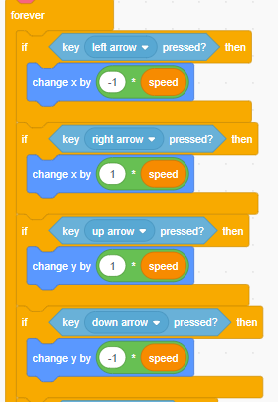

The left and right arrows change the ball's x position by -1 and 1 respectively and the up and down arrows change the ball's y position by 1 and -1 respectively.

### Adding another key for movement

To add the option to use the A key to move left we need to change the if statement to check whether the left arrow OR the A key is pressed (it doesn't matter if they both are, the ball should still move left). Grab just the `key left arrow pressed?` block and drag it onto some spare space in the code area.

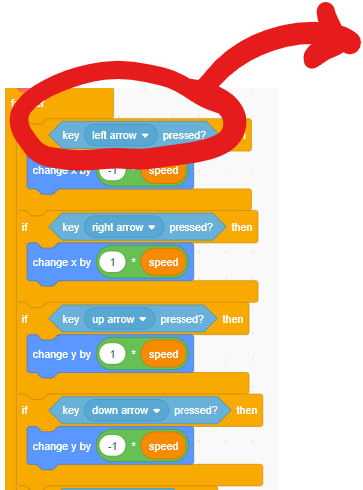

Now click the `Operators` group and drag an OR block into the empty space you just made in the if block. Your code should look something like this:

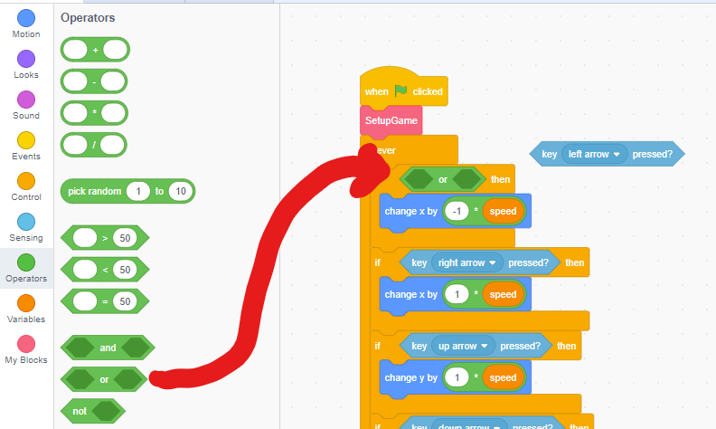

Next, right-click on the `key left arrow pressed?` block you just removed and choose duplicate from the menu. Drag the copy you made into one of the slots in the OR block and drag the original into the other slot.

Now, change one of the `left arrow` choices to `a`:

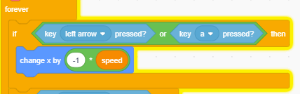

Repeat the steps above for each of the other movement control if statements and add the `d` key for right, the `w` key for up and the `s` key for down. Your code should now look like this:

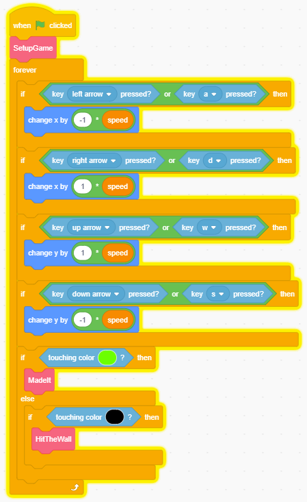

Run the game and check that you can now control the movement of the ball with the `WASD` keys.

Congratulations! Now you're ready to move on to [Connecting your BBC micro:bit](./maze3.md)

[|< Home](../README.md)  
[<< Previous: Standing on the shoulders of giants](./maze1.md)  
[>> Next: Connecting your BBC micro:bit](./maze3.md)
