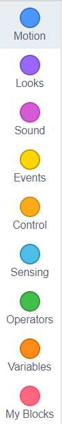
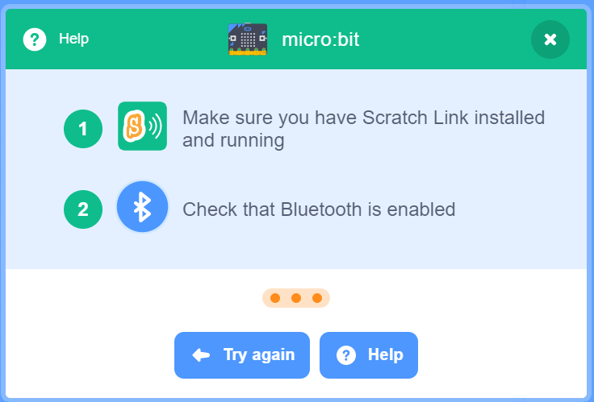

# Connecting your BBC micro:bit

[|< Home](../README.md)  
[<< Previous: Adding your own controls](./maze2.md)  
[>> Next: Controlling the game with tilt](./maze4.md)

Now you've seen how to change the controls to a different key combination, it's time to see how you can add a new input device entirely. In this case we're going to use the [BBC micro:bit](https://www.microbit.org/)

From their website:

> micro:bit is a tiny programmable computer, designed to make learning and teaching easy and fun!

The picture above (taken from the [micro:bit features page](https://www.microbit.org/guide/features/)) shows the large number of sensors, inputs and outputs on this little board. The ones you'll be using are:

* [accelerometer](https://www.microbit.org/guide/features/#accel) (to find out which way the board is tilting)
* [LED lights](https://www.microbit.org/guide/features/#leds) (to show a message when you hit a wall or finish a level)
* [button A](https://www.microbit.org/guide/features/#buttons) (to act as a brake)
* [USB connector](https://www.microbit.org/guide/features/#usb) (to power the board)
* radio and [Bluetooth](https://www.microbit.org/guide/features/#bluetooth) antenna (to communicate to your game)

## Extensions in Scratch

Until now, we've just been using the basic blocks for Scratch

Scratch has the concept of allowing people to create additional sets of blocks. These are called Extensions. These extensions are used to do all kinds of things includin playing music, drawing on the screen and interacting with microcomputers like the Micro:Bit.

To allow us to interact with the Micro:Bit, we need to add the Micro:Bit extension to the project. Extensions are accessed through the Extensions button at the bottom-left of the screen:

Clicking this button will take you to another page which shows all the available extensions:

Choose the micro:bit extension.

You'll be returned to your project. Notice that the functions group now has an additional set of blocks for interacting with the micro:bit

>### Aside
>
>Note that you might get a message saying that you need to install some additional software called Scratch Link  

> Click the help button and you'll be taken to a web page that allows you to install a program that helps scratch talk to the micro:bit over either your USB cable or over Bluetooth.  
> Note that there are two versions, one for Windows and one for macOS

[|< Home](../README.md)  
[<< Previous: Adding your own controls](./maze2.md)  
[>> Next: Controlling the game with tilt](./maze4.md)
