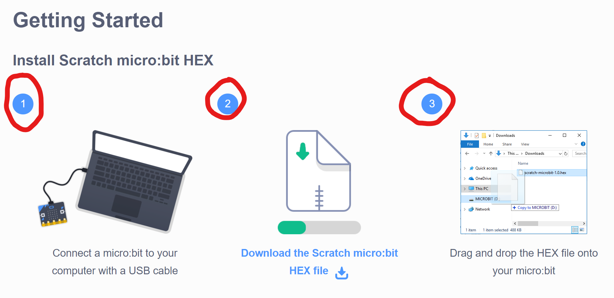
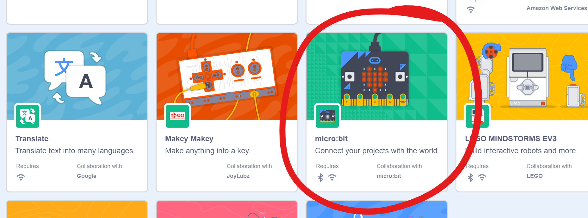
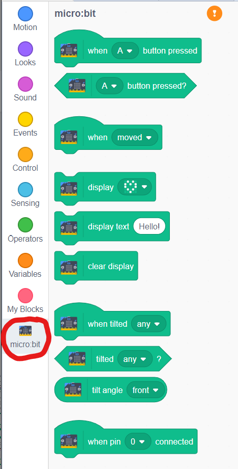

# Connecting your BBC micro:bit

[|< Home](../README.md)  
[<< Previous: Adding your own controls](./maze2.md)  
[>> Next: Controlling the game with tilt](./maze4.md)

Now you've seen how to change the controls to a different key combination, it's time to see how you can add a new input device entirely. In this case we're going to use the [BBC micro:bit](https://www.microbit.org/)

From their website:

> micro:bit is a tiny programmable computer, designed to make learning and teaching easy and fun!

The picture above (taken from the [micro:bit features page](https://www.microbit.org/guide/features/)) shows the large number of sensors, inputs and outputs on this little board. The ones you'll be using are:

* [accelerometer](https://www.microbit.org/guide/features/#accel) (to find out which way the board is tilting)
* [LED lights](https://www.microbit.org/guide/features/#leds) (to show a message when you hit a wall or finish a level)
* [button A](https://www.microbit.org/guide/features/#buttons) (to act as a brake)
* [USB connector](https://www.microbit.org/guide/features/#usb) (to power the board)
* radio and [Bluetooth](https://www.microbit.org/guide/features/#bluetooth) antenna (to communicate to your game)

### Installing the Scratch micro:bit Support

To enable Scratch to work with the micro:bit you need to install software on your computer, update the software running on the micro:bit, and add the micro:bit extension to Scratch.

#### Step 1. Install and start Scratch Link you to your computer

* Click the [Scratch/micro:bit support page](https://scratch.mit.edu/microbit) and follow the instructions to install and start Scratch Link.

#### Step 2. Connect and Install Scratch support onto your micro:bit

* Connect your micro:bit to your computer with a USB cable.

* Click the [Scratch/micro:bit support page](https://scratch.mit.edu/microbit) and follow the instructions to install Scratch micro:bit HEX.

#### Step 3. Add the Scratch Link Extension

Until now, we've just been using the basic blocks for Scratch. To allow us to use the micro:bit with Scratch, we need to add micro:bit support to the project.

Scratch has the concept of allowing people to create additional sets of blocks. These are called Extensions. These extensions are used to do all kinds of things including playing music, drawing on the screen and interacting with microcomputers like the micro:bit.

Extensions are accessed through the Extensions button at the bottom-left of the screen:

Clicking this button will take you to another page which shows all the available extensions:

Choose the **micro:bit extension**.

### Step 4. Verify the micro:bit Extension is Enabled

You will be returned to your project. Notice that the functions group now has an additional set of blocks for interacting with the micro:bit

Now you're ready to use your micro:bit to control the ball in the maze.

## Troubleshooting

Follow the troubleshooting guide on the [Scratch/micro:bit support page](https://scratch.mit.edu/microbit).

## Bluetooth Support

If you have a micro:bit battery pack then you can also connect to your micro:bit to your computer via Bluetooth. If there are several micro:bits showing up in the connection window, you can identify yours by looking at the LEDs. There should be a set of 5 letters scrolling across them. Those letters are a unique label for your micro:bit and you can find that label in the list and connect to that one, then click the `Go to editor` button.

[|< Home](../README.md)  
[<< Previous: Adding your own controls](./maze2.md)  
[>> Next: Controlling the game with tilt](./maze4.md)
