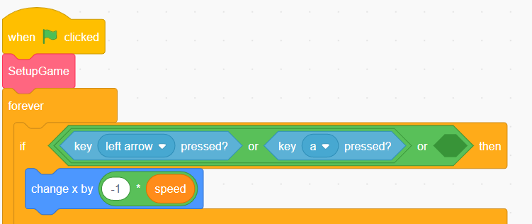

# Controlling the game with tilt

[|< Home](../README.md)  
[<< Previous: Connecting your BBC micro:bit](./maze3.md)  
[>> Next: Adding a brake](./maze5.md)

Just like in the section on [Adding you own controls](./maze2.md), you can use the micro:bit to control the ball in the maze.

Find the section of code that responds to the keys being pressed:

Instead of just reacting to keys being pressed, you're going to be able to tilt the microbit and have the ball react to the way the board is being tilted. Tilt it left, the ball will go left, tilt it right, the bll will go right. Similarly for up and down.

Start by picking up the `left arrow or a key pressed` block and move it to a spare bit of the screen.

Now click the `Operators` group and drag an OR block into the empty space you just made in the if block. Your code should look something like this:

Drag the `left arrow or a key pressed` block you put aside into the first space in your new `or` block

Next, click on the `micro:bit` group and drag a `tilted any` block into the empty space left in the `or` block.

Finally, change drop down the `any` option in the `tilted` block you just added and change it to `left`

Run the game and try moving left by tilting your mico:bit.

Next, follow the same procedure as above for the other three directions. Note that you might hav to experiment to work out which waw tilting front and back moves the ball.

When you finish, your control code should look something like this:

Play your game with all of the tilty-goodness enabled!

You may notice that it's sometimes hard to stop in the right place or in time, so let's add the ability to stop the ball, no matter where we're tilted.

Move onto the next section, [Adding a brake](./maze5.md).

[|< Home](../README.md)  
[<< Previous: Connecting your BBC micro:bit](./maze3.md)  
[>> Next: Adding a brake](./maze5.md)
