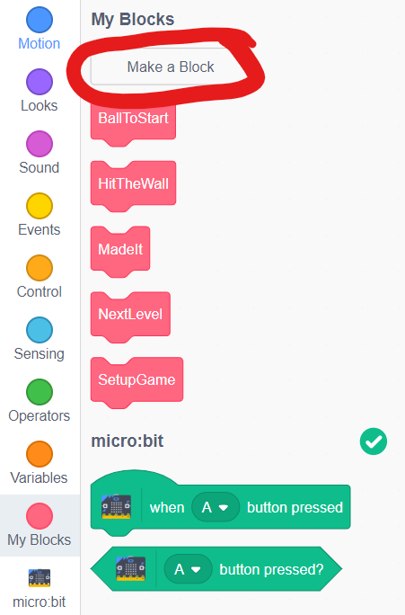
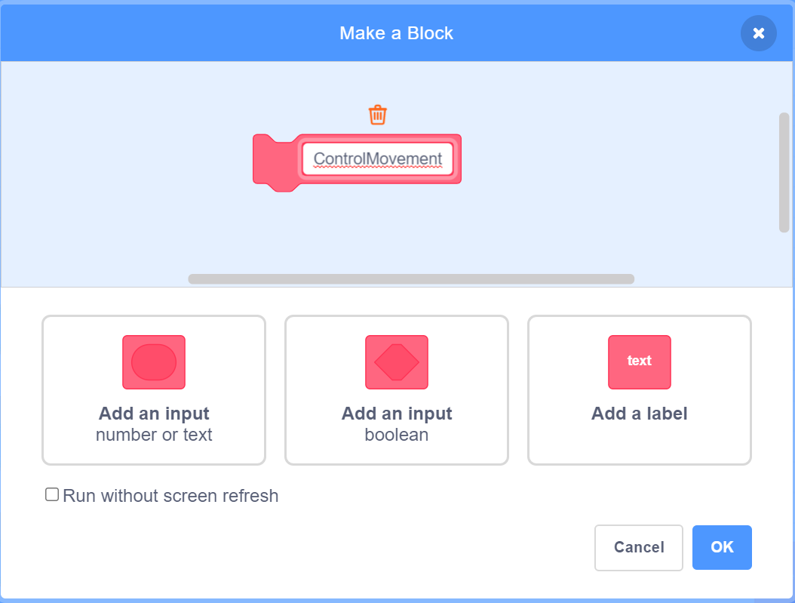
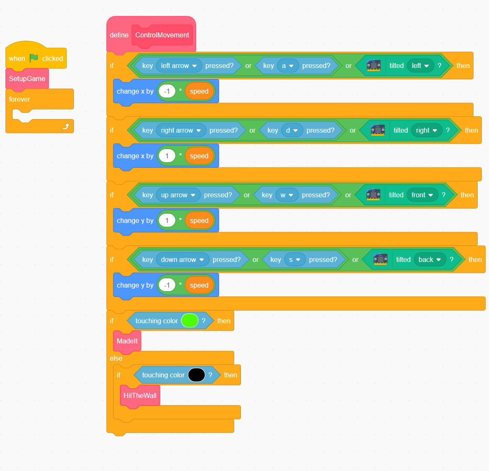
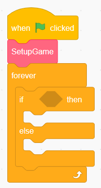
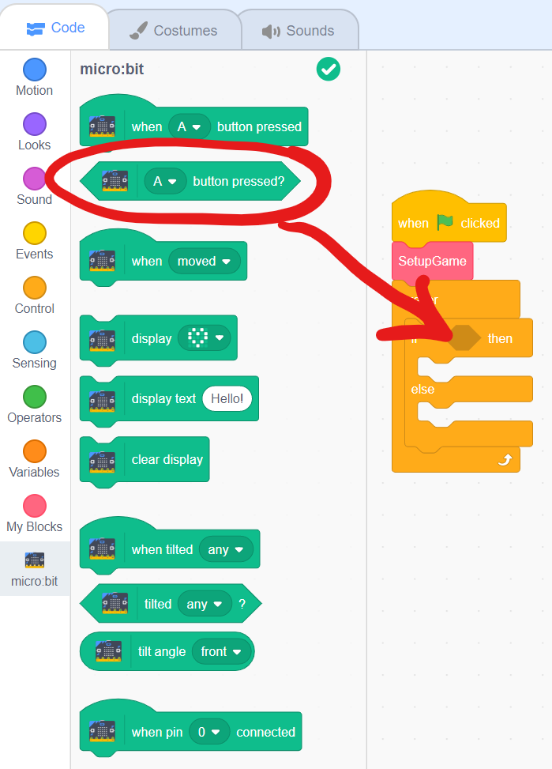
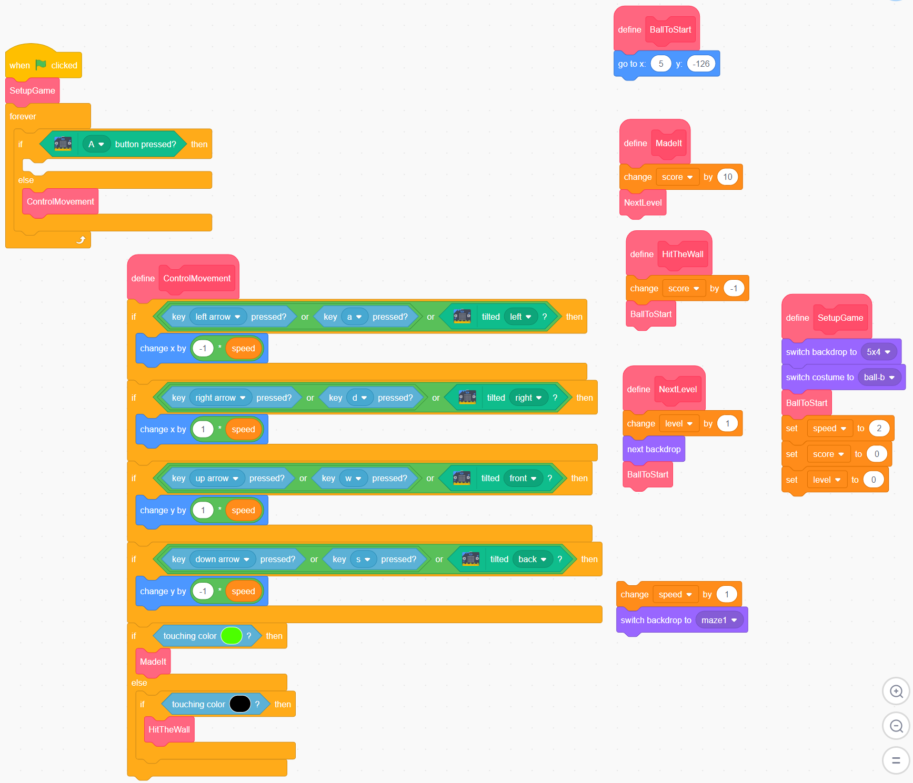

# Adding a brake

[|< Home](../README.md)  
[<< Previous: Controlling the game with tilt](./maze4.md)  
[>> Next: Ideas for more enhancements](./maze6.md)

Sometimes you might just want to stop the ball so you can re-centre and take a breath. Let's add a brake button that disables all movement while it's pressed.

First, let's break out the movement code into a `My Block`:

In the `My Blocks` group, click the `Make a Block` button

Call the new My Block something like `ControlMovement` and click `OK`

Pick up the `if` block immediately below the start of the `forever` loop and drag it onto the new `ControlMovement` block. Note that everything inside the `forever` loop will come - that's what you want.

Into the `forever` loop, drag an `if...then...else` block from the `Control` group

To check whether the button is pressed, drag a `A button pressed?` check from the `micro:bit` group into the `if ... then` check

Leave the `if` section blank (do nothing if the button is pressed). From the `My Blocks` group, drag a `ControlMovement` block into the `else` area.

Your code should now look like this:

Run the code and play your game - check that you can stop all movement by pressing `Button A`

[|< Home](../README.md)  
[<< Previous: Controlling the game with tilt](./maze4.md)  
[>> Next: Ideas for more enhancements](./maze6.md)
