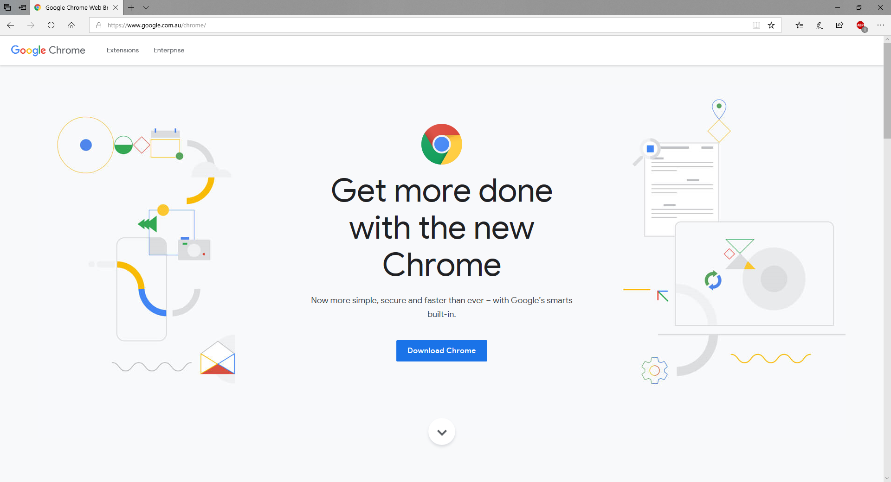
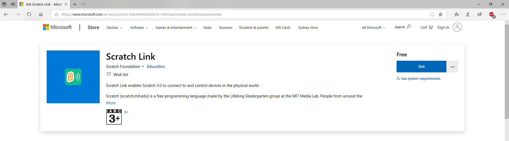

# Pre-requisites for coding workshops

Follow the checklist for your computer to get ready for the coding workshop.

## PC (Windows)

To start with the lessons, you will need a browser. You should already have Edge on your computor or you can download [Chrome](https://www.google.com.au/chrome/).

You will also need to download [Scratch Link](https://www.microsoft.com/en-au/p/scratch-link/9n48xllczh0x?lc=3081&activetab=pivot%3Aoverviewtab).

You are now ready to create a spiral.

## Mac (OsX)