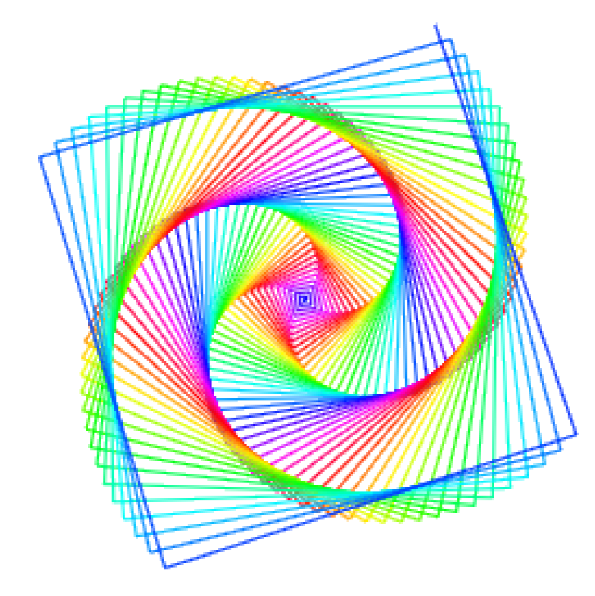

# Spirals and Other Shapes

[|< Home](../README.md)  
[>> Next Setting Up](./spirals1.md)

Once upon a time, people used to draw on computer screens by moving a turtle around. The turtle had a pen strapped to its belly (don't ask me why) and wherever it went it left a mark. By giving the turtle instructions like "move forward 10 paces" or "turn left 90 degrees" you could draw shapes or even pictures.

We can do something similar with Scratch using the pen module. We'll end up with a rainbow spiral that looks something like this:

[|< Home](../README.md)  
[>> Next Setting Up](./spirals1.md)