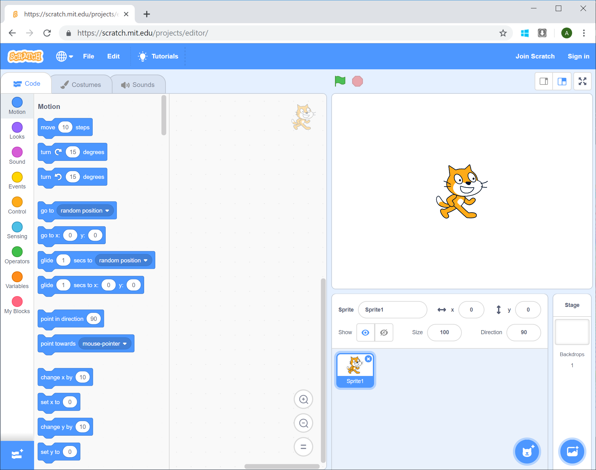

# Setting Up

[|< Home](../README.md)  
[<< Previous: Spiral Introduction](./spirals0.md)  
[>> Next: Drawing a Line](./spirals2.md)

To start, go to the [Scratch Editor](https://scratch.mit.edu/projects/editor/) website. You'll see something like this:

There are two things to do before you start writing code. One you have to do, and the other you'll want to do.

First the one you'll want to do. Make the cat character smaller - it gets in the way of what you're going to draw. Later we'll see how to turn it off completely. To make it smaller change the size in the bottom-right quadrant of the screen from 100 to 20. Just overwrite the value that's there at the moment. When you do (and click back outside the size field) the cat will be much smaller (approximately one fifth the size :)):

The second thing to do is to add support for a pen. Scratch has a concept of extensions that add functionality. There's lots more information about scratch extensions on the [Scratch Wiki](https://en.scratch-wiki.info/wiki/Scratch_Extension), but for now just follow along.

Right down in the bottom-left of the screen, there's a button that looks like this:

Click that and you'll get a list of extensions available to you. The list will look a bit like this:

Some of these look pretty interesting, and we'll come back to this page in later tutorials, but for now, just click the one called Pen (in the middle at the top in the picture above). This adds some additional functionality to the main screen. More on this later. Your scratch workspace should now look something like this (with the pen extension added):

Next, we'll see how to use this added functionality.

[|< Home](../README.md)  
[<< Previous: Spiral Introduction](./spirals0.md)  
[>> Next: Drawing a Line](./spirals2.md)
