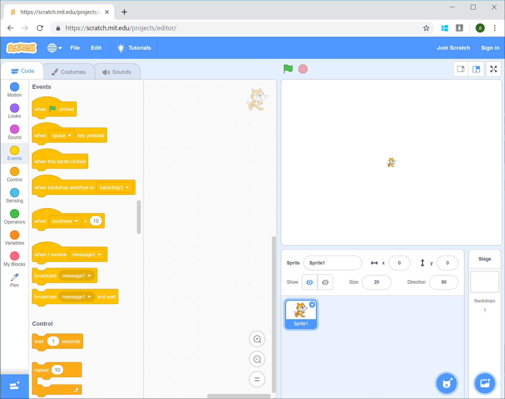

# Drawing a Line

[|< Home](/)  
[<< Previous: Setting Up](./spirals1.md)  
[>> Next: Drawing a Square](./spirals3.md)

The spiral you'll draw is made up of lines, so the first thing to learn how to do is draw a line.

To make Scratch do anything, you need to give it a signal to start doing that thing. In programming-speak, this thing is called an "event". Events are all kinds of things a computer can recognise, like clicking a mouse, pressing a key and so on. In this case we're going to make the program start drawing when the space bar is pressed.

Scratch uses blocks that you join together to make a program (we just added some new blocks by adding the pen extension). Groups of blocks are represented on the left-hand side of the screen. Click on the one called Events.

When you click on a group, the blocks associated with that group are displayed in the block pane. Here's what it should look like after you click the Events group:

Notice that most of the event blocks are shaped like a rectangle with a bulge on the top and the text inside starts with the word "When". The shape symbolises the start of a program, and the word "When" tells you that this program, will start when the event described by the text occurs. In our case, we want the program to start when the space key is pressed, so drag that block from the block pane to the program pane:

Your scratch workspace should now look something like this:

Start your program by pressing the space key.

Notice that ... ***NOTHING HAPPENS!***

That's ok, it will really soon, just a couple more steps.

To draw a line you need to do 2 things, put the pen on the page and move it, so let's do those 2 things.

Choose Pen from the list of block groups.

Drag the Pen Down block directly below the When space key pressed event block. Notice that they fit together like a puzzle and when you get close to the right spot, the border around the Pen Down block is highlighted.

Now move the pen. Select the Motion block group and drag the Move 10 Steps block directly below the Pen Down block in the same way as before, making sure they snap together.

Your scratch workspace should now look like this:

Run your program by pressing the space key - you should see the cat move a small distance to the right leaving a line behind it.

**Congratulations!** You just ran your program. 

It's a bit hard to see the line so let's make it a bit bigger.

In the move block in the program pane, change the number 10 to 100.

Click anywhere outside the field where you typed 100 and then press the space key again. This time the cat moves further and leaves a longer line.

Press the space key a couple more times. The line keeps getting longer and eventually the cat hits the edge of the screen and stops. We need a way of resetting the system to the same state at the start of every run, so let's add some logic for that.

At the start of every run we want:

* Cat at the middle of the screen
* Cat facing to the right
* Screen clear of any lines
* Pen down, ready to draw

Each of these is a block. The first two are Motion blocks and the last two are Pen blocks. Find the applicable blocks and drag them into your program in the right order.

You may need to re-arrange the order of some of the blocks. To do this you need to separate them from the program blocks above, then move any blocks below. A good way to think about this is to realise that any block you drag will also move all the block below it, but none above it.

When you've finished inserting the blocks to reset the state, your scratch workspace should look something like this:

> **Aside**  
> Notice that the go to block has both x and y set to 0. This is because the centre of the screen in scratch is at (0,0). Not all systems do this, some have (0,0) at the bottom left, and others have (0,0) at the top left and have y getting bigger as you go down the screen!

Run your program by pressing the space key and notice that it always starts in the same place and finishes in the same place. In fact, it might run so fast that you don't see it change at all. That's ok, it just means your computer moves faster than you can see.

Enough of single lines, let's branch out into something more two-dimensional. Next we'll make a square.

[|< Home](/)  
[<< Previous: Setting Up](./spirals1.md)  
[>> Next: Drawing a Square](./spirals3.md)