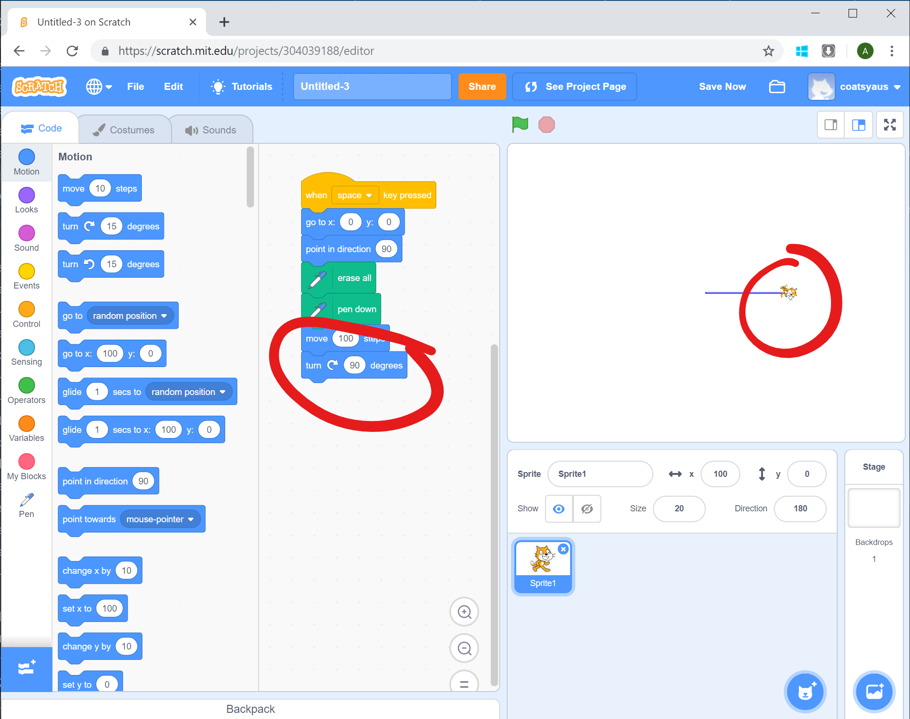
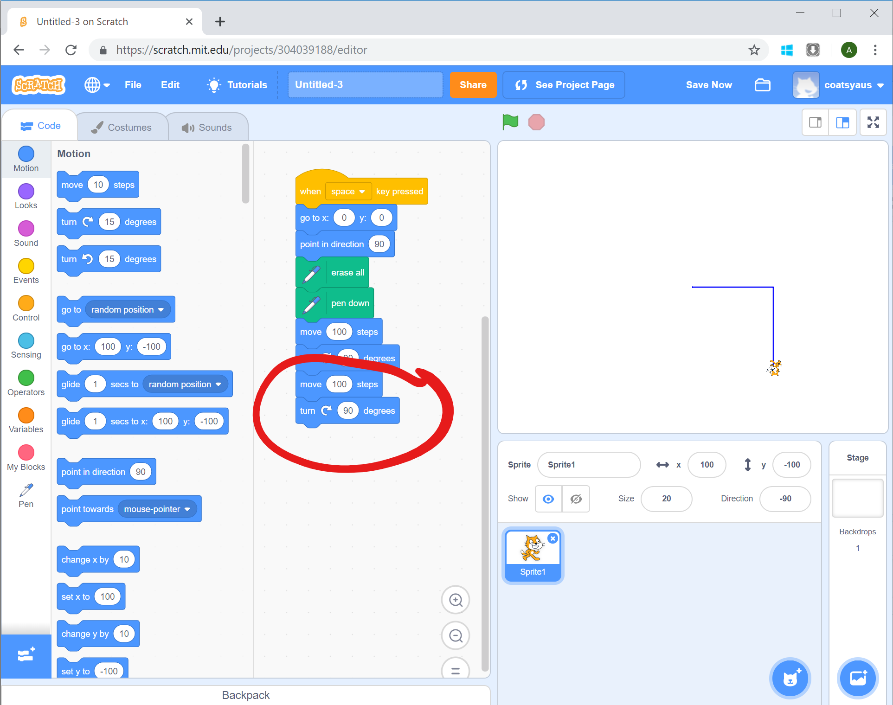
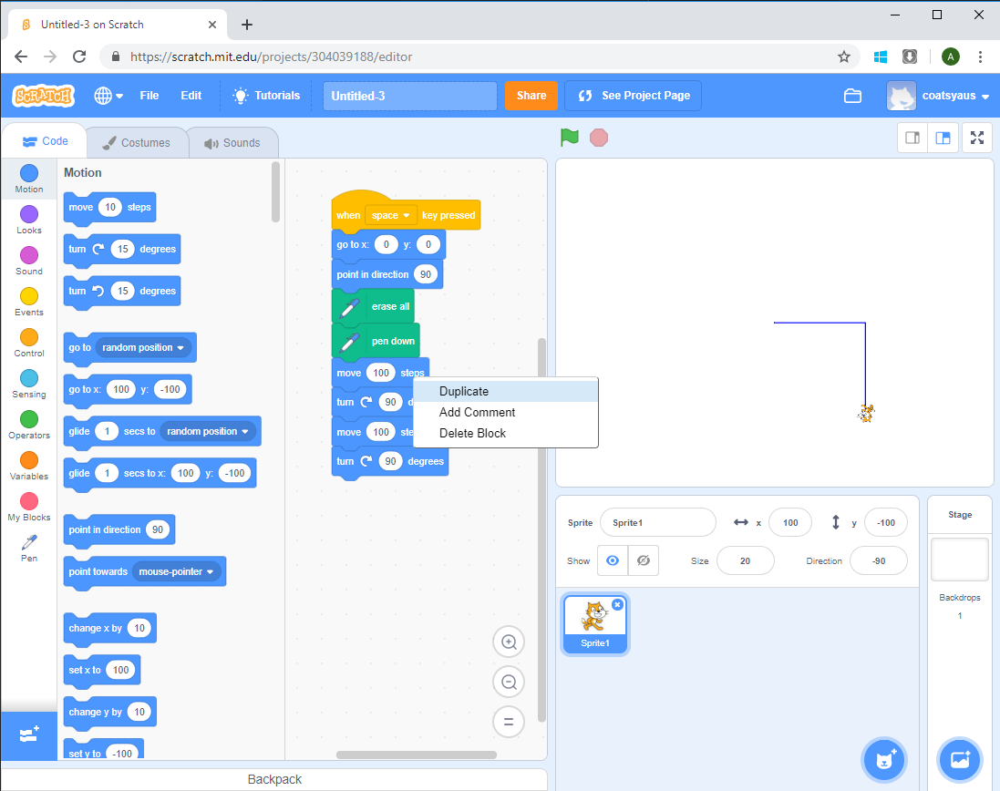
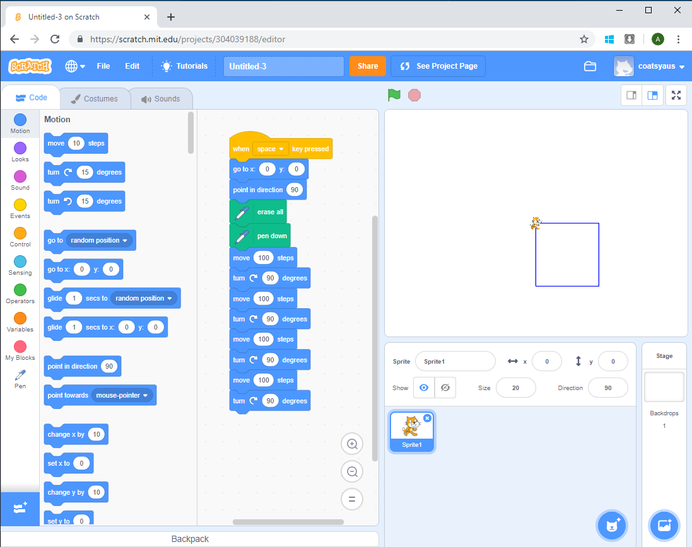
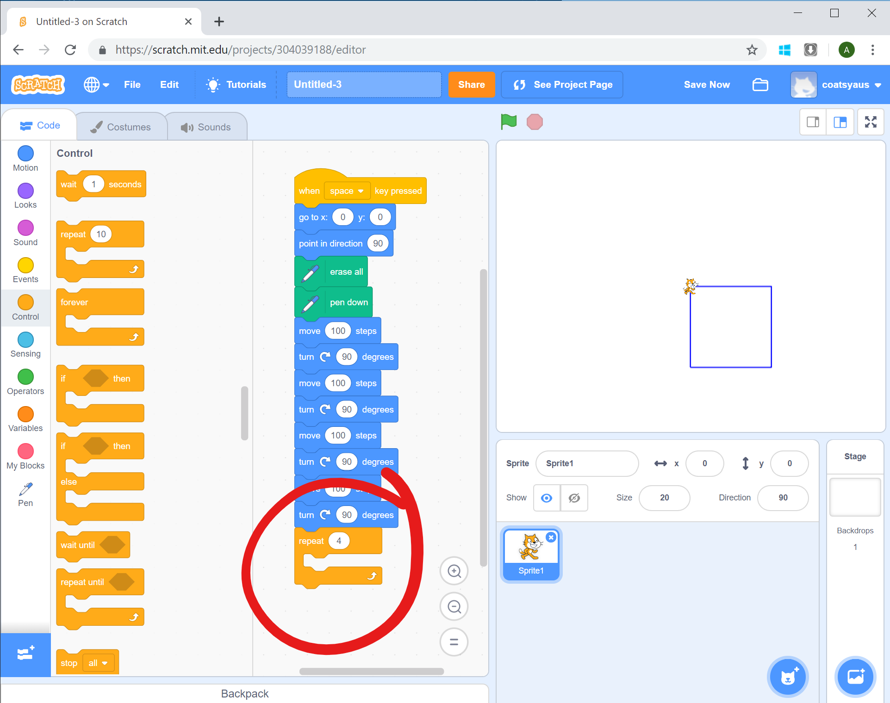
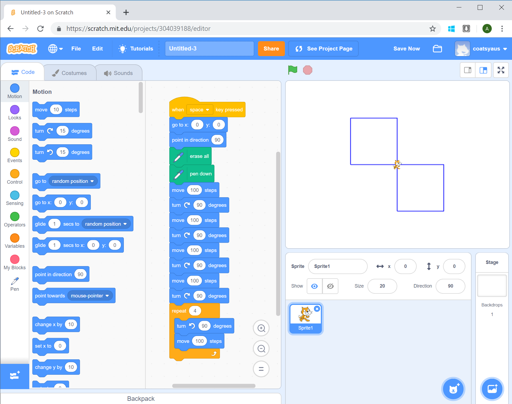

# Drawing a Square

[|< Home](../README.md)  
[<< Previous: Drawing a Line](./spirals2.md)  
[>> Next: Drawing a Spiral](./spirals4.md)

Like our spiral, squares are just made up of lines. You might remember that the definition of a square is a four-sided figure where the corners are all right-angles and the sides of equal length.

We've already drawn one side, so the next thing to do is add a right angle. From the Motion group of blocks, drag a turn right block to below the move block and change the number of degrees to 90 (for a right-angle).

Notice that when you run the program, it doesn't look very different, but if you look closely, the cat is now facing down the screen rather than across it. That means we can move forward along the next side.

Drag another move block below the turn block and change the distance to 100.

Now drag another turn right block below that move block and change the angle to 90 degrees.

When you run the program you've now got 2 sides of the square.

Notice that drawing 2 sides of a square actually involves doing the same thing twice. To add the other 2 sides, you could just do the same thing two more times, but fortunately, Scratch has a way of duplicating blocks of code.

Move your mouse so it's over the first of the move blocks and click the right mouse button. A menu will pop up and you can choose "duplicate". This will make a copy of the block you right-clicked on and all the connected blocks below it.

Drag the duplicated blocks to the bottom of the program and slot them in. When you run the program now, you'll get a full square!

## Using a Loop

One of the things computers are really good at is doing the same thing over and over again. Notice that drawing a square is just a matter of doing the same two things (move forward, turn right) four times.

There's a way to tell scratch to repeat a step or series of steps, it's called a repeat block. The repeat block lives in the Control group.

Select the Control group and find the block that says Repeat 10. Drag it onto the bottom of the program and change the 10 to 4.

To draw a square we just need to tell scratch which commands to repeat 4 times. Notice that you can drag blocks inside the repeat block. Drag a turn left and a move block inside the repeat loop and set the number of degrees to 90 and the distance to 100.

This is a much easier way to draw a square than having to duplicate code blocks.

Now you've mastered drawing a square, it's time to move on to drawing a spiral.

[|< Home](../README.md)  
[<< Previous: Drawing a Line](./spirals2.md)  
[>> Next: Drawing a Spiral](./spirals4.md)