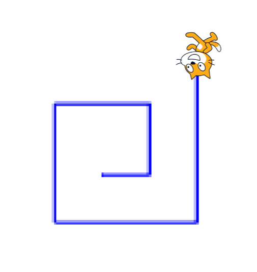

# Drawing a Spiral

[|< Home](../README.md)  
[<< Previous: Drawing a Line](./spirals3.md)  
[>> Next: More Challenges](./spirals5.md)

Spirals are a special kind of repeating pattern. Starting in the middle of the spiral, each line, or leg, gets a little bit longer so by the time the cat gets back, it's a little bit further away.

[|< Home](../README.md)  
[<< Previous: Drawing a Line](./spirals3.md)  
[>> Next: More Challenges](./spirals5.md)