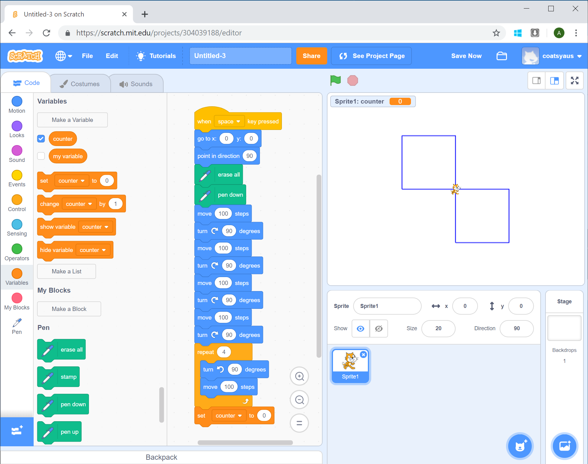
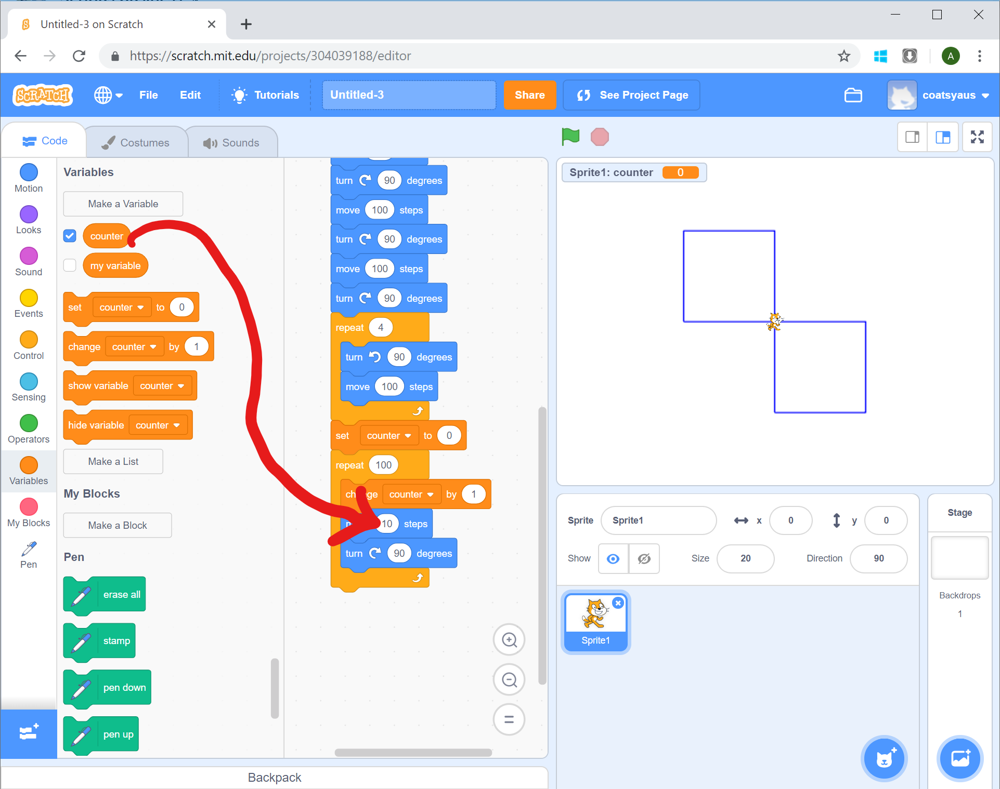

# Drawing a Spiral

[|< Home](../README.md)  
[<< Previous: Drawing a Line](./spirals3.md)  
[>> Next: Adding Colour](./spirals5.md)

Spirals are a special kind of repeating pattern. Starting in the middle of the spiral, each line, or leg, gets a little bit longer so by the time the cat gets back, it's a little bit further away.

## Variables

To make each leg a little longer each time the commands are repeated, we need a way of keeping track of how long it should be each time.

In computer terms, this is called a variable, because it varies over the life of the program.

Variables are defined and accessed through the Variables group of blocks. In the Variables group, click the `Make a Variable` button.

In the screen that pops up, call the variable `counter` and make it for this sprite only. Then click `OK`.

Now you've defined the variable, you need to give it an initial value. In this case we're going to start with a line that's 1 long and go up by 1 each time we loop through.

Drag the `Set counter to 0` block to the bottom of the program.

Now we're ready to start the spiral loop. Drag a `Repeat 10 times` block from the control group to the bottom of the program and change `10` to `100` (you may need to scroll the program pane down a little to find the bottom of the program).

Just like making a square, building a spiral is just doing two things over and over again, moving and turning. The only extra thing to do is change how far the movement should be.

Each time we go through the loop we want to move a little further, so each time we're going to change the value of counter by 1. There's a block fro that in the Variables group. Add that block inside the loop.

Now we'll add the 2 standard things - move and turn. Add a `Move 10 steps` block and a `Turn right 15 degrees` block. Note that these are inside the loop, under the `change counter by 1` block.

Change the turn block to `90` degrees.

If you run the program now, you'll just get a little square, but if you make the leg length the value of the counter variable, the spiral magic appears.

To make the leg length use the counter variable's value, choose the Variable group and drag the `counter` block onto the region of the move block where the value's currently 10.

There's a trick to getting the variable block in the right place - the left edge of the block needs to line up with the left edge of the text area.

Run the program now and you should have a simple spiral in the middle of your screen.

## Adding a twist

Spirals can look even cooler if they have a twist to them. If you get the cat to turn a little bit more or less than 90 degrees you get some pretty cool effects.

Try that now, change the turn value inside your spiral loop from 90 to 91 degrees. Run the program again and enjoy the twist.

[|< Home](../README.md)  
[<< Previous: Drawing a Line](./spirals3.md)  
[>> Next: Adding Colour](./spirals5.md)