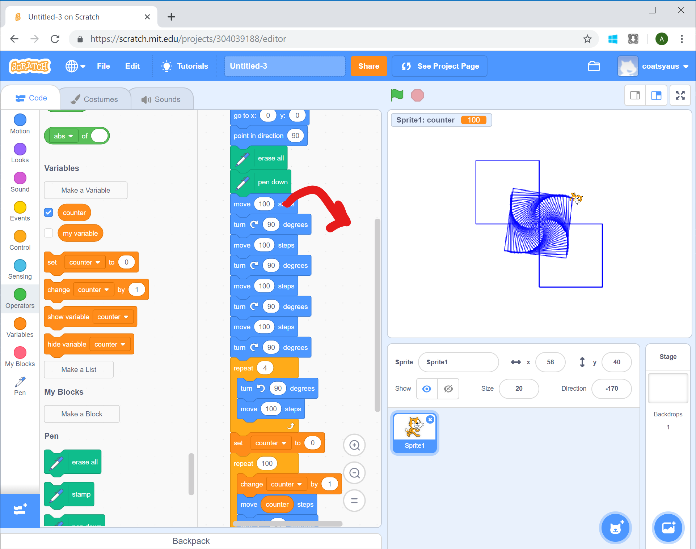
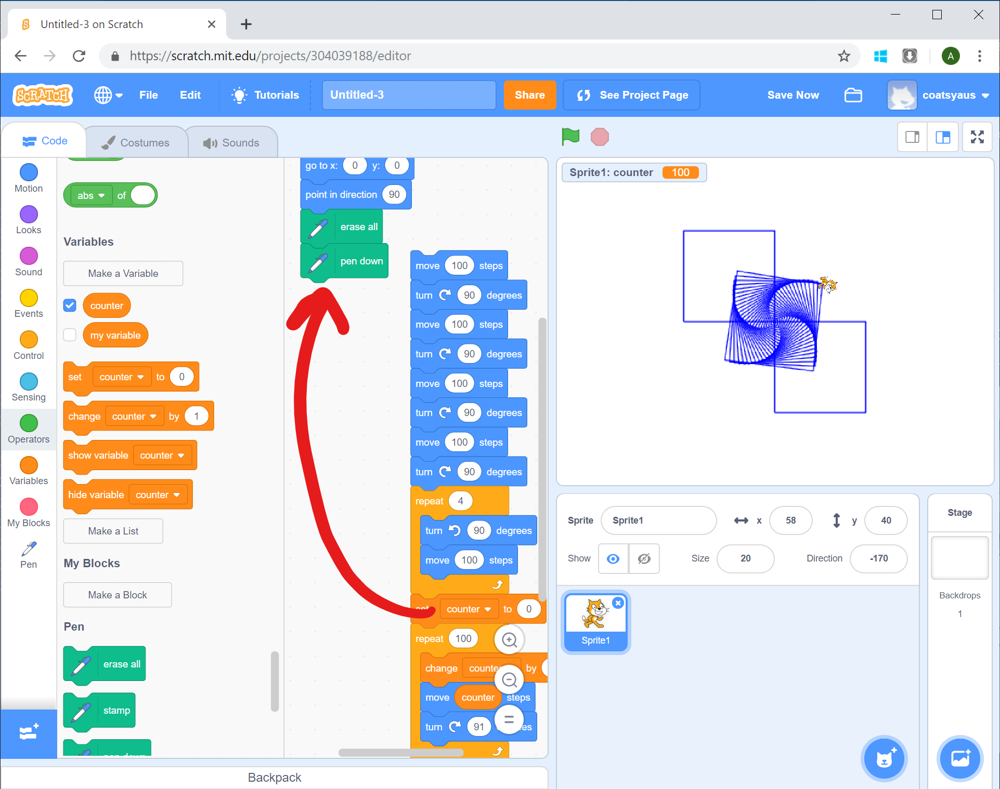
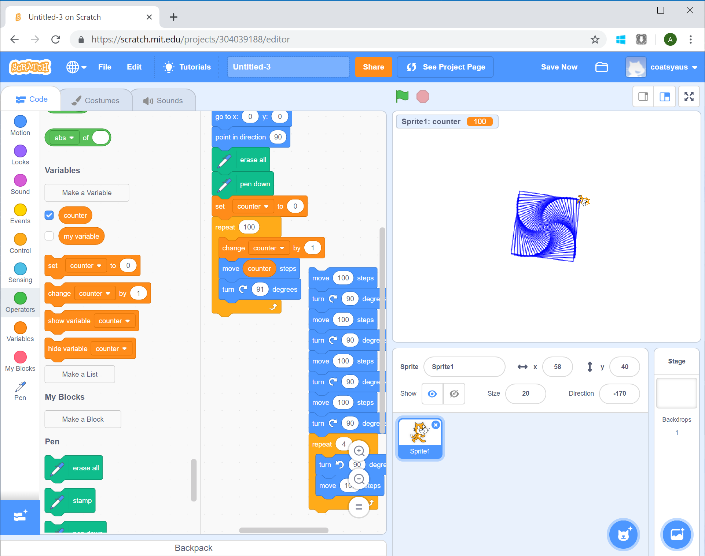
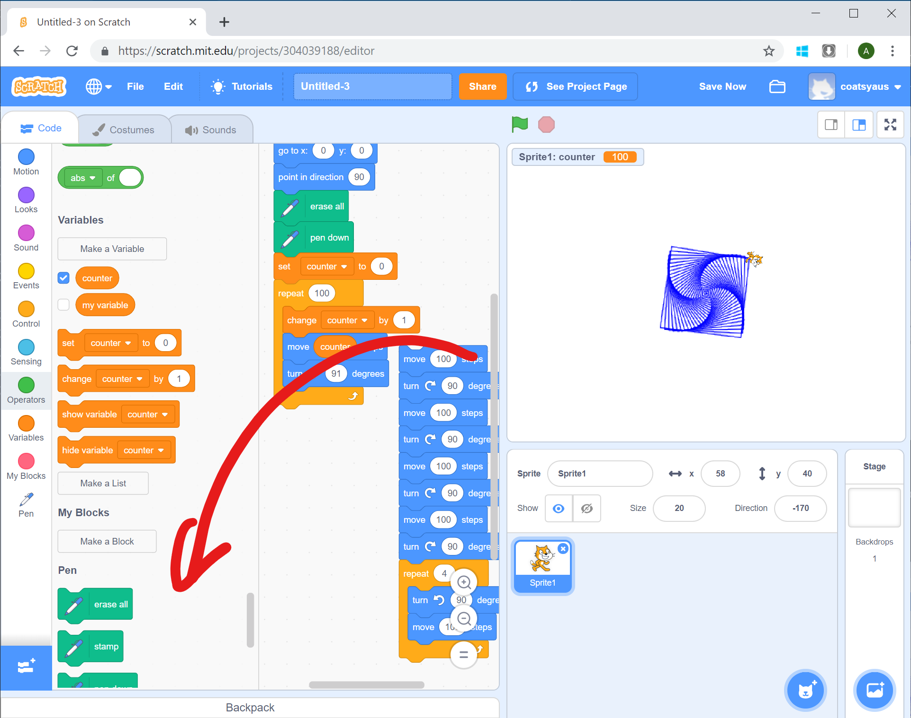
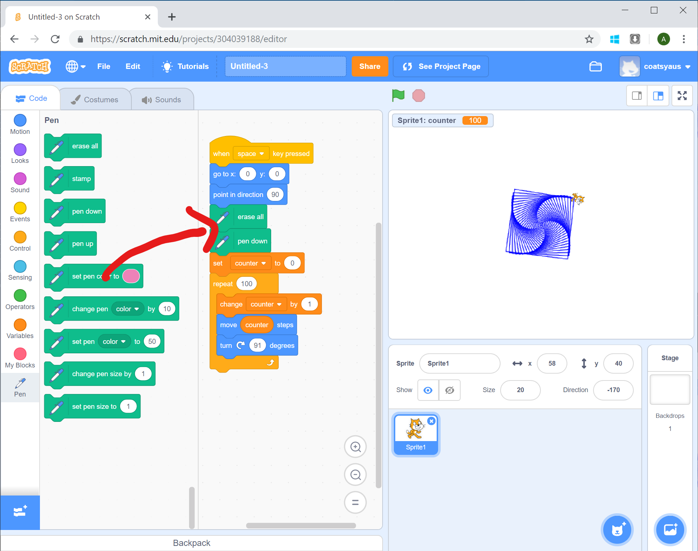
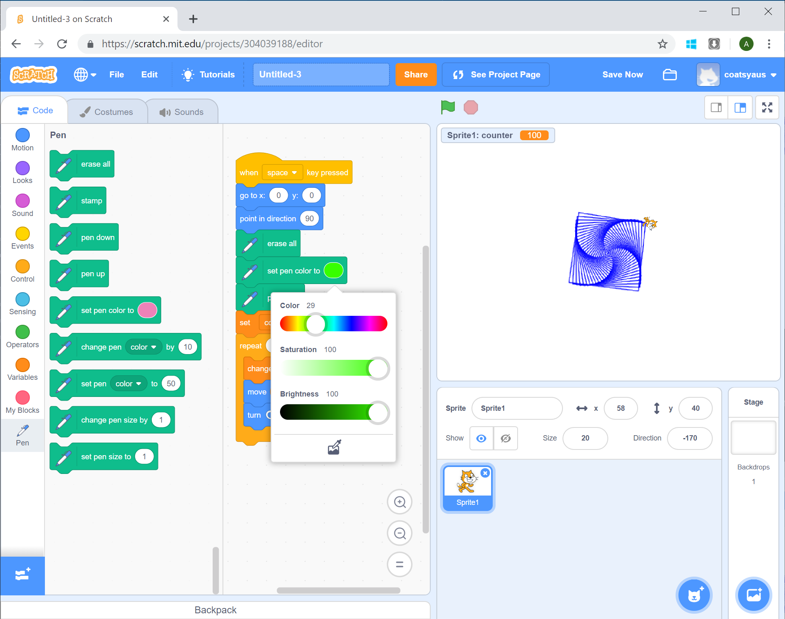
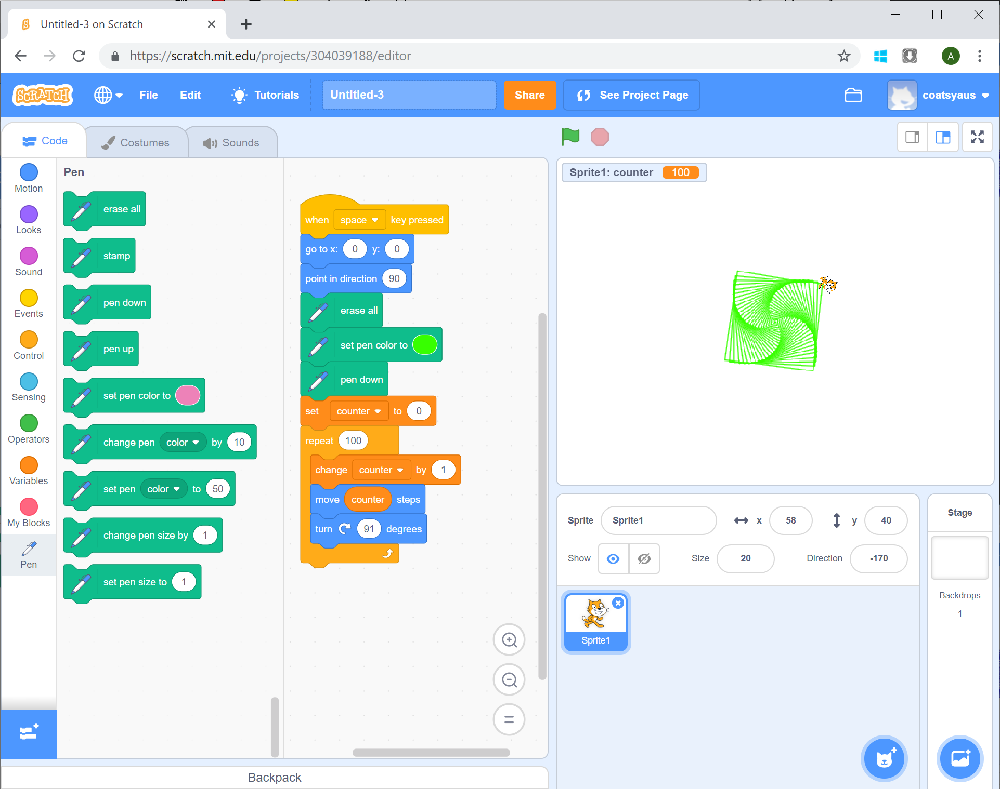
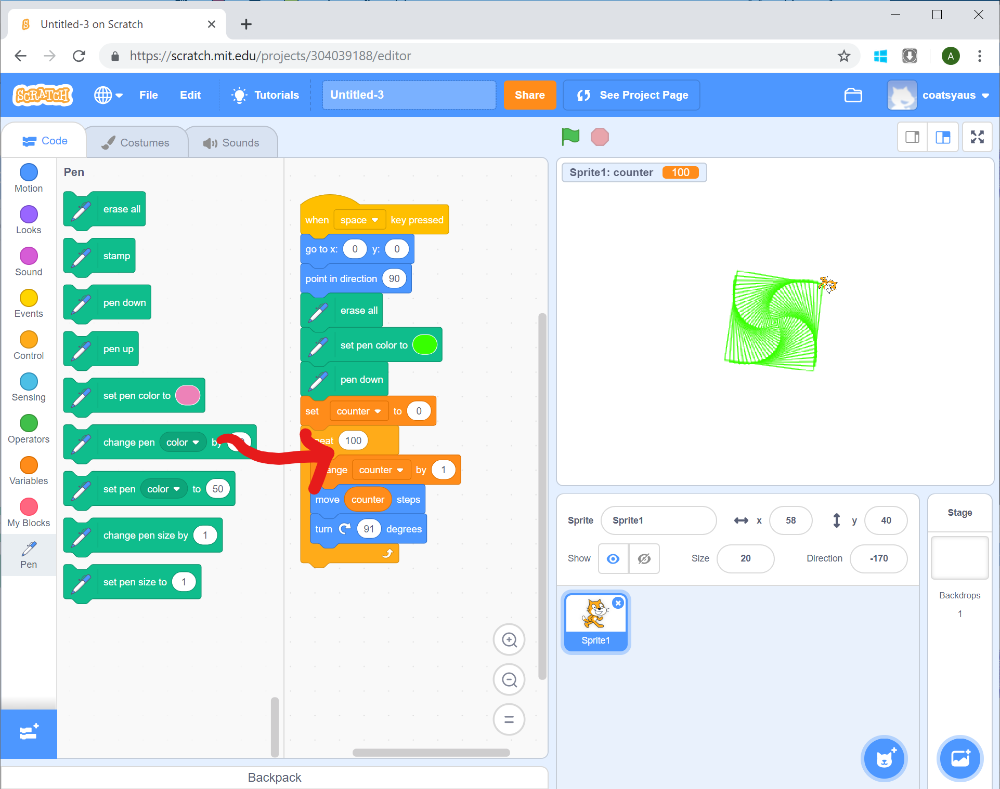
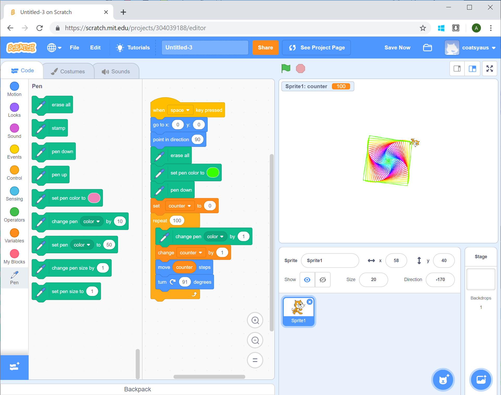

# Adding Colour

[|< Home](../README.md)  
[<< Previous: Drawing a Spiral](./spirals4.md)  
[>> Next: More Challenges](./spirals6.md)

Up 'til now, the pen colour we've used has been whatever the standard colour is. It's time to jazz things up a bit.

## Cleaning Up

Every time you run the program, in addition to the spiral you're building, you get the two squares we made at the start. They've served their purpose and it's time for them to go.

Remember that whenever you drag a part of the program, all of the blocks underneath come as well so getting rid of the square drawing blocks is a 2-step process:

1. Drag them off the program
1. Put spiral loop bits back

Find the first `Move 100 steps` block - right after the `pen down` block and drag it just to the side of the program - still within the program pane. Don't worry if you make a mistake, Ctrl+Z (on a PC) or Command+Z (on a Mac) will undo any mistakes you make.

Now pick up the spiral logic from the stack you just removed and reattach it to the program. Remember the spiral loop logic actually starts with the `set counter to 0` block that initialises the counter variable.

Now when you run the program, just the spiral will appear.

If you want to get rid of the square logic blocks, just pick up the top one (and the others will be attached) and drag it onto the block pane.

## Changing Colour

Scratch makes it pretty easy to set the colour of the pen. From the Pen group, drag a `set pen color to` block in between the `erase all` and `pen down` blocks.

Click on the colour in the block you just added and choose a colour for the pen.

While you're there, set the `Saturation` and `Brightness` to 100.

Now when you run the program, your spiral will be drawn in the colour you chose.

Just like the leg lengths of the spiral, you can change the colour of each leg too. Scratch has a way of looping through all the colours of the rainbow so you can change the pen colour each time to make a pretty cool effect.

Drag a `change pen color by 10` block to the top of the blocks inside the `repeat 100` loop.

Change the value from 10 to 1 and then run the program. See the pretty colours.

Awesome! You've built a rainbow spiral, now it's time to move onto some more challenges.

[|< Home](../README.md)  
[<< Previous: Drawing a Spiral](./spirals4.md)  
[>> Next: More Challenges](./spirals6.md)
