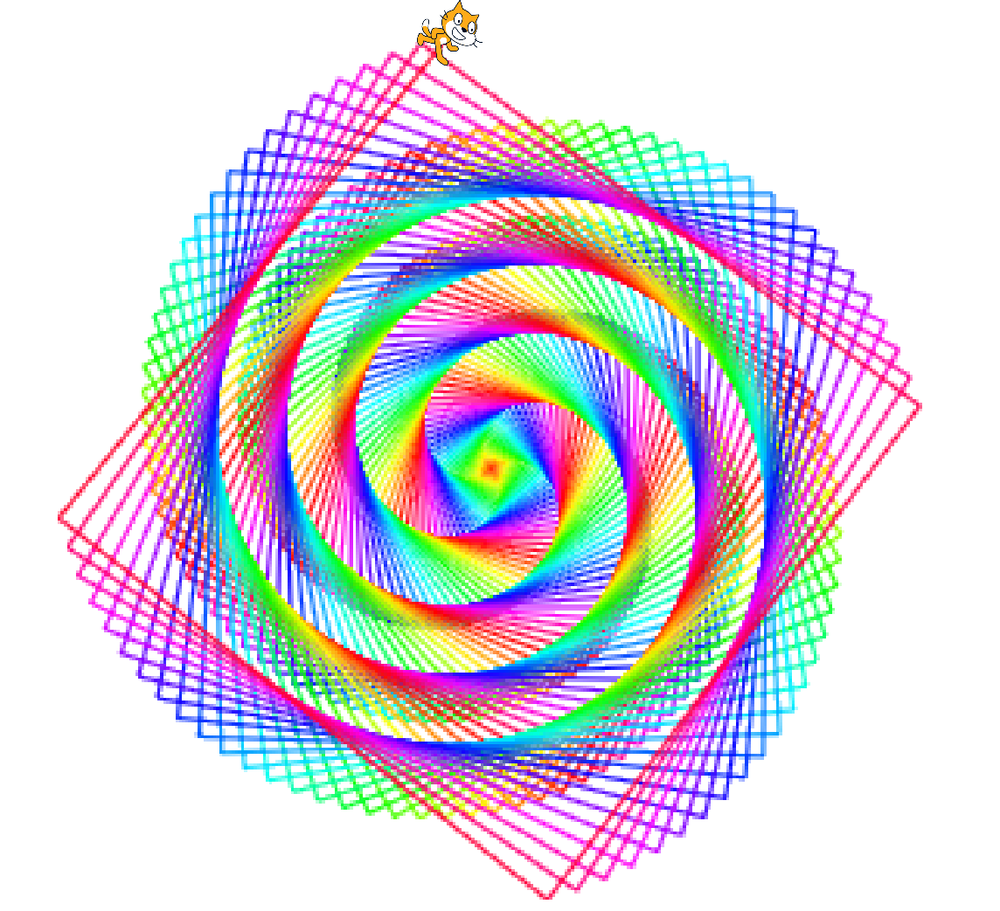
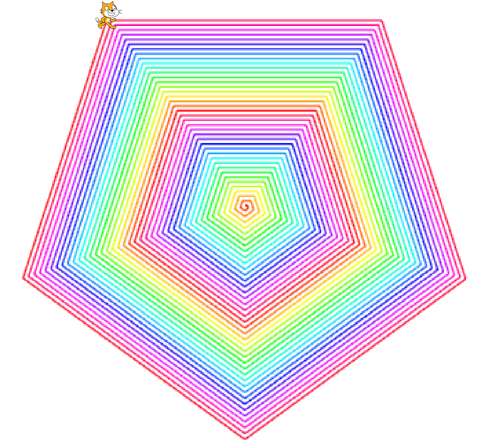
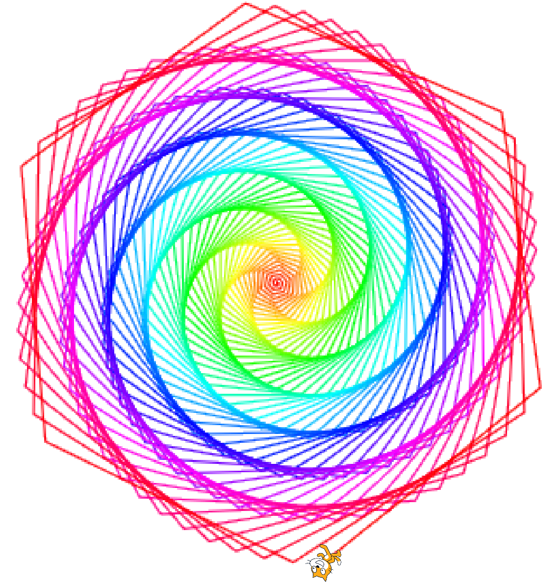
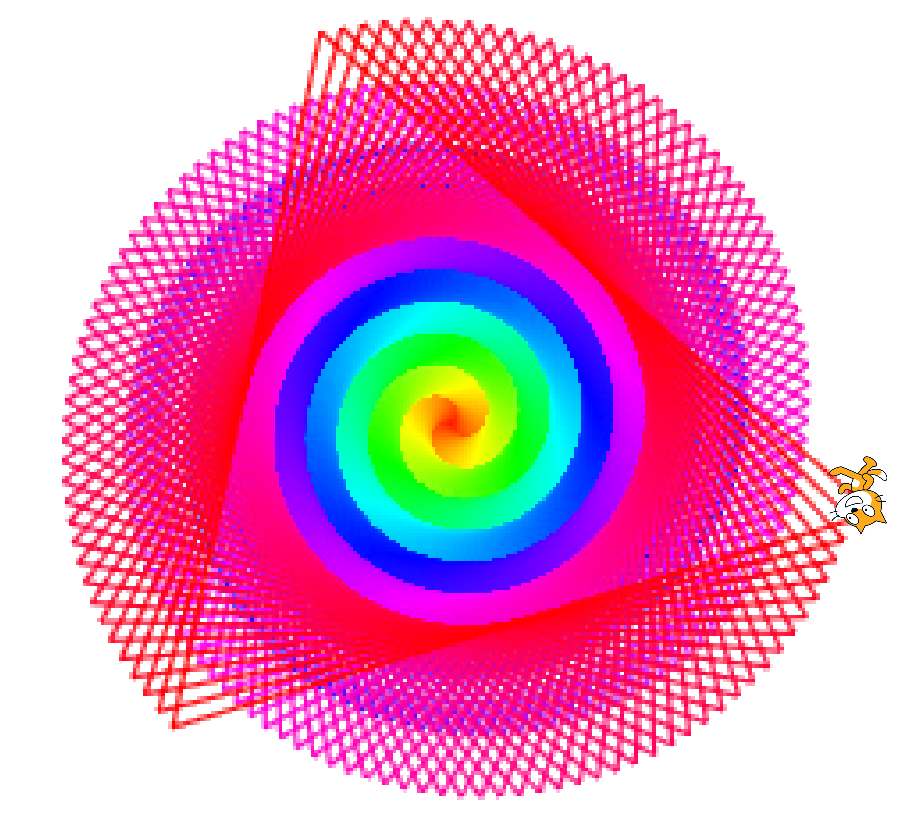

# More Spiral Challenges

[|< Home](../README.md)  
[<< Previous: Adding Colour](./spirals5.md)

Here are some more spirals created using just the code you've already written, just with a few of the values changed. See if you can reproduce them.

See if you can work out how to make regular-sided figures or to add extra colours.

You can play with a number of these parameters in the <a href="https://scratch.mit.edu/projects/303918558/" target="_blank">Spiral Playground</a>. Click See Inside to change the values. Press the s key to create a spiral.

[|< Home](../README.md)  
[<< Previous: Adding Colour](./spirals5.md)
